# 星敏数字员工系统功能介绍文档

**系统介绍版**\
**编制日期：** 2026年4月\
**文档版本：** V1.0

***

## 一、产品概述

星敏数字员工是一套面向企业客户的智能服务与业务协同平台。

它以自研 IM 通信能力为连接底座，以 AI 智能体、知识库、工作流、客户管理、业务表单、审批协同等能力为核心，将原本分散在聊天工具、Excel、人工传递和多个业务系统中的服务流程，逐步沉淀为统一、可追溯、可配置、可持续优化的数字化体系。

星敏数字员工不是单一的聊天机器人，也不是只能做客服接待的轻量工具，而是一套可持续扩展的企业级平台，能够帮助企业完成以下升级：

- 从人工接待走向 AI 与人工协同
- 从零散回复走向统一服务口径
- 从单次沟通走向客户资产沉淀
- 从即时响应走向流程协同与业务闭环
- 从单点工具走向可复制的平台能力

***

## 二、建设目标

企业在客户服务、业务协同和内部管理过程中，常见问题通常包括：

| 常见问题     | 典型现状                     | 对企业的影响       |
| -------- | ------------------------ | ------------ |
| 客户响应慢    | 依赖人工在线值守，高峰期或非工作时段难以及时承接 | 客户流失、体验下降    |
| 服务口径不统一  | 不同员工回答标准不一致，知识依赖个人经验     | 专业度不足，容易出错   |
| AI 难真正落地 | 只有问答，没有知识、规则、流程与人工协作机制   | 看起来智能，实际不可控  |
| 客户数据不沉淀  | 客户资料、会话过程、处理结果散落在各工具中    | 难运营、难复盘、难优化  |
| 协同效率低    | 报价、审批、资料、表单等仍靠线下传递       | 处理慢、跟进难、责任不清 |
| 系统扩展弱    | 现有工具只能接待，难承接后续业务         | 无法支持长期数字化建设  |

围绕这些问题，星敏数字员工的建设目标主要包括：

1. 提升客户接待效率\
   通过 AI 智能体、在线工作台、转人工策略和智能分流能力，让客户咨询更快被响应和处理。
2. 统一服务口径与处理规则\
   通过知识库、提示词、流程配置、规则控制等能力，把服务经验沉淀为系统能力。
3. 建立高效的人机协同模式\
   让 AI 处理高频标准问题，让人工承接复杂、高价值、敏感场景。
4. 沉淀客户与服务数据\
   将客户资料、会话记录、处理轨迹、表单数据、审批记录等统一沉淀为长期资产。
5. 支撑后续行业化扩展\
   在智能服务底座上，逐步扩展报价、订单、商品、资料、审批、打印、对接等模块。

***

## 三、系统整体闭环

星敏数字员工围绕“客户接入 - 智能处理 - 人工协同 - 数据沉淀 - 业务协同”形成完整闭环：

1. 客户通过官网、二维码、链接、插件页、嵌入页等入口进入系统
2. 系统识别入口、客户属性、上下文信息与服务策略
3. AI 智能体结合知识库、商品数据、规则与工作流进行首轮处理
4. 命中复杂问题、重点客户或敏感场景后转人工接入
5. 人工在统一后台继续沟通、查看客户信息、推进业务处理
6. 客户信息、会话过程、业务表单、审批动作、报价记录等统一沉淀
7. 如有需要，进入报价、订单、打印、资料下载、流程审批等后续业务环节

从产品视角看，星敏数字员工不是“前台聊天 + 后台配置”的简单组合，而是一套能够把接待、客户、规则、数据、协同和业务统一起来的平台型产品。

### 3.1 总体思路

建议采用 **“智能接待 + 人工专家 + 知识规则 + 平台协同”** 的整体思路建设星敏数字员工。

在实际落地中，系统承担以下角色：

- **AI 智能体**：负责首轮承接、内容识别、基础问答、规则命中和效率提升
- **知识与规则体系**：负责统一口径、约束处理逻辑、支撑标准化服务
- **人工坐席/业务人员**：负责复杂问题、重点客户、异常情况和最终判断
- **管理平台**：负责过程留痕、菜单能力、权限控制、协同待办、模板输出和数据分析

### 3.2 方案定位

星敏数字员工不是单点功能，而是一套以智能服务为核心、面向多角色使用、可按行业持续扩展的企业级平台，具备以下特征：

- 能承接企业当前最核心的客户接待与服务协同场景
- 能适配不同岗位、不同租户和不同业务分工方式
- 能把实时沟通和后台管理打通，形成统一作业平台
- 能从“客服工具”逐步演进为“客户服务与业务协同平台”

### 3.3 适用角色

系统可面向多类角色使用：

| 使用角色 | 主要关注点 | 典型使用模块 |
|---|---|---|
| 客服坐席 | 实时接待、转人工处理、客户沟通 | IM 在线客服、会话管理、客户信息 |
| 销售/商务 | 客户跟进、需求承接、客户转化 | 客户信息、联系任务、咨询管理、扩展业务模块 |
| 运营人员 | 知识维护、规则配置、入口管理、效果观察 | 知识库、智能体配置、入口管理、执行记录 |
| 主管/负责人 | 效率、待办、协同进度、服务质量 | 首页看板、流程实例、我的待办、日志 |
| 实施/管理员 | 用户权限、租户配置、菜单能力、参数维护 | 用户管理、角色管理、权限管理、参数配置、租户管理 |
| 企业客户/多组织 | 行业扩展、平台复制、长期使用 | 商品、资料、表单、订单、报价等扩展模块 |

### 3.4 一期建设重点

从落地效果和实施风险角度，建议优先建设企业最核心、最能快速见效的部分：

- 首页看板与实时接待工作台
- 智能体配置与知识库管理
- 转人工规则与智能体路由
- 客户信息与客户运营能力
- 流程协同与业务表单能力
- 平台基础管理能力

### 3.5 系统可以实现的问题

相比传统依赖聊天记录、人工经验和零散工具的方式，系统可以帮助企业实现：

- 咨询统一承接，减少遗漏和响应延迟
- 人工与 AI 协同处理，提升整体服务效率
- 知识统一管理，减少回答口径不一致
- 客户资料持续沉淀，便于后续复用和经营
- 服务过程可留痕、可回放、可复盘
- 内部协同可在线推进，减少反复沟通成本
- 平台能力可扩展，支持后续更多业务场景接入

***

## 四、后台模块总览

当前后台可按以下模块理解：

| 模块分组    | 主要页面/能力                                              | 核心价值                  |
| ------- | ---------------------------------------------------- | --------------------- |
| 首页看板    | 首页 Dashboard                                         | 统一查看平台运行状态、会话趋势、待处理事项 |
| 系统管理    | 用户管理、用户审批、角色管理、权限管理、字典管理、参数配置、操作日志                   | 保障平台安全运行与权限边界清晰       |
| 客户管理    | 客户信息、客户规则管理                                          | 沉淀客户主档与归属规则           |
| 客户运营    | 客户标签、客户联系任务                                          | 支撑客户分层与持续经营           |
| 服务协同    | 咨询管理、投诉管理                                            | 承接客户服务问题与处理闭环         |
| IM 管理   | 在线客服、会话管理、入口管理、智能体配置、执行记录、知识库、转人工规则、设备/账号/路由、插件、对接配置与租户管理 | 构成星敏数字员工的智能服务核心区      |
| 智能体测试   | 测试用例、测试方案、测试记录                                       | 支撑智能体质量评估与迭代优化        |
| 业务表单    | 业务单据、打印模板管理、动态表单配置、导出记录                              | 承接结构化数据、模板化输出和流程协同    |
| 审批流管理   | 流程定义、流程实例、我的待办                                       | 打通审批协同和过程留痕           |
| 可扩展业务模块 | 报价管理、订单管理、商品管理、资料下载管理、线索类模块等                         | 支撑行业化落地与业务闭环扩展        |
| 辅助工具    | API 测试等                                              | 支撑联调、验证和排障            |

说明：不同角色和租户看到的菜单范围可能有所不同，但系统的统一产品名称和能力核心，建议始终表述为“星敏数字员工平台”。

***

## 五、后台模块详细说明

### 5.1 首页看板

首页看板是管理者和执行人员进入系统后的总览页面，用于集中查看平台运行状态和当前服务节奏。

该模块通常关注：

- 今日会话量
- AI 处理量
- 转人工数量
- 待接入客户
- 人工服务中会话
- 最近趋势变化
- 快捷处理入口

它的价值在于让企业对“系统现在发生了什么”一目了然，适合作为管理总览和日常运营入口。

**配图建议：**

### 5.2 系统管理

系统管理是平台稳定运行的基础，主要面向管理员、实施人员和负责人使用。

包含的主要子模块如下：

| 子模块  | 作用说明                  |
| ---- | --------------------- |
| 用户管理 | 维护平台用户账号、人员信息和可登录人员范围 |
| 用户审批 | 对用户开通、特殊权限或关键身份进行审批控制 |
| 角色管理 | 按岗位或职责定义角色能力范围        |
| 权限管理 | 控制菜单、按钮、数据操作边界        |
| 字典管理 | 统一维护状态值、分类值、基础枚举等公共数据 |
| 参数配置 | 维护系统运行参数、业务开关和通用配置    |
| 操作日志 | 记录关键操作过程，满足审计和追溯要求    |

这一模块的核心价值不直接体现在客户接待上，但它决定了平台是否能长期稳定、安全、规范地运行。

### 5.3 客户管理

客户管理模块用于沉淀客户主档，是平台从“会话处理”走向“客户经营”的关键。

主要包括：

| 子模块    | 作用说明                         |
| ------ | ---------------------------- |
| 客户信息   | 查看和维护客户基本资料、联系方式、来源、状态、标签等信息 |
| 客户规则管理 | 配置客户归属、负责人、分配策略、自动编号等规则      |

该模块的核心价值在于：

- 把一次对话沉淀为长期客户资产
- 让后续跟进有统一客户主档
- 为标签、任务、报价、审批等后续能力提供统一对象基础

**配图建议：**

下图展示 `客户列表` 页面，适合体现客户主档的统一沉淀、检索与负责人管理能力。

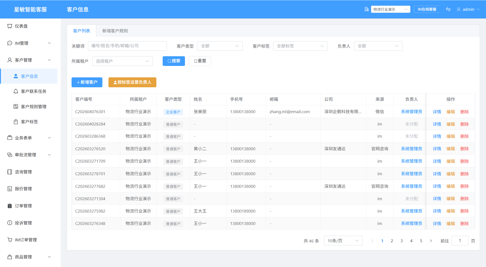

下图展示 `客户详情` 页面，可体现客户类型、来源、标签与关联业务记录的集中查看方式。

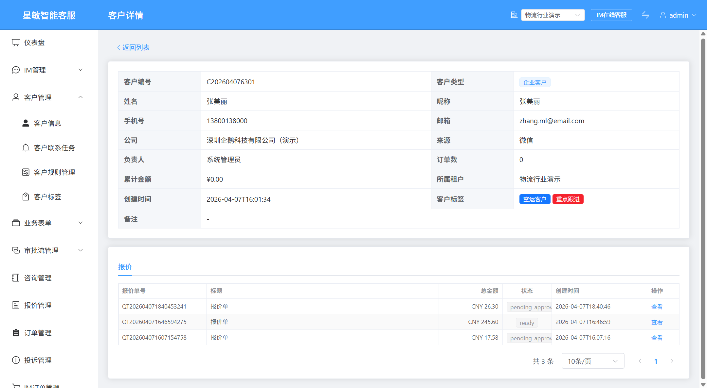

### 5.4 客户运营

客户运营模块强调“客户持续经营”而不是“一次性接待”。

主要包括：

| 子模块    | 作用说明               |
| ------ | ------------------ |
| 客户标签   | 对客户进行分类、分层、分组管理    |
| 客户联系任务 | 维护客户跟进任务、回访计划和运营动作 |

这一模块的价值在于帮助企业把客户服务延伸到客户经营，适合销售、运营、客服主管等角色持续使用。

**配图建议：**

下图补充展示客户标签在客户详情中的呈现方式，便于说明标签分层与重点客户识别能力。

### 5.5 服务协同

服务协同模块用于承接客户问题、记录服务过程，并推动问题闭环。

主要包括：

| 子模块  | 作用说明             |
| ---- | ---------------- |
| 咨询管理 | 统一管理客户咨询记录和处理情况  |
| 投诉管理 | 记录和跟进客户投诉，形成闭环管理 |

该模块适合需要标准化处理客户问题的企业场景，有助于提升服务透明度、责任清晰度和复盘能力。

### 5.6 IM 管理

IM 管理是星敏数字员工最核心的后台区域，承担实时沟通、智能服务、智能体配置、规则控制和渠道接入等关键能力。

#### 5.6.1 IM 在线客服

IM 在线客服是一线坐席的主工作台，用于实时接待客户、查看消息历史、承接人工会话和联动客户资料。

核心价值：

- 统一处理实时会话
- 提升人工接入效率
- 让客服处理有上下文、有客户信息、有留痕

**配图建议：**

#### 5.6.2 IM 会话管理

IM 会话管理用于统一查看历史会话和处理情况，便于监督、复盘和问题排查。

适合用于：

- 查看全部会话记录
- 筛选不同状态会话
- 回看 AI 与人工协作过程
- 辅助管理和优化服务策略

#### 5.6.3 IM 入口管理

IM 入口管理用于维护客户进入系统的各类入口，如二维码、链接、嵌入页、插件入口等。

其核心价值在于：

- 支撑多入口获客
- 配置差异化欢迎语和接待策略
- 为入口统计和智能路由提供基础

#### 5.6.4 智能体配置

智能体配置是星敏数字员工的核心配置模块之一，用于为不同业务场景配置不同 AI 智能体。

典型配置内容包括：

- 系统提示词
- 模型参数
- 知识库关联
- 工作流配置
- 启停控制
- 场景范围

它的核心价值在于把企业服务经验转化为可配置、可维护、可持续优化的智能能力。

**配图建议：**

下图展示智能体基础配置界面，适合说明提示词、模型参数、知识库关联和启停控制等配置项。

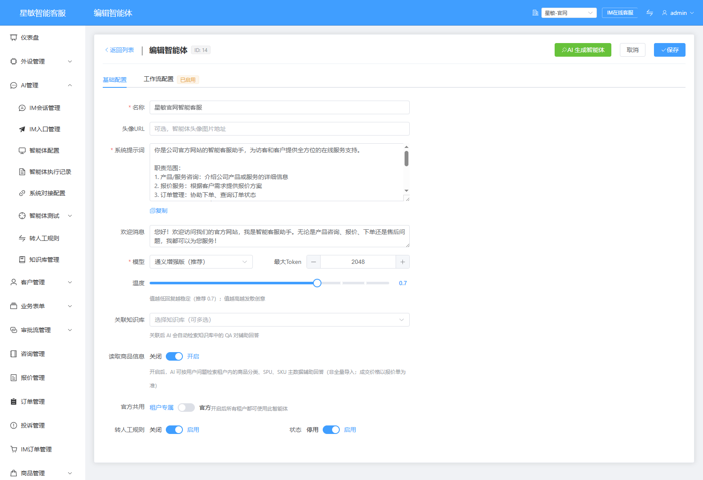

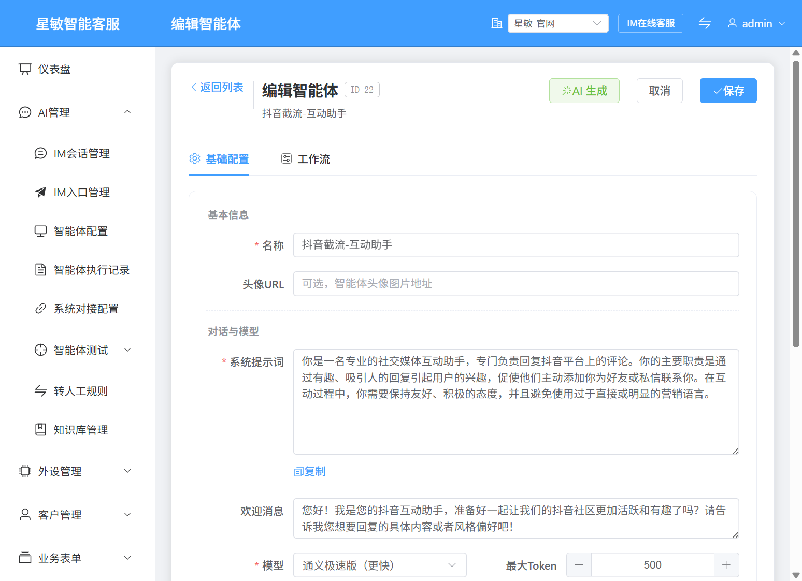
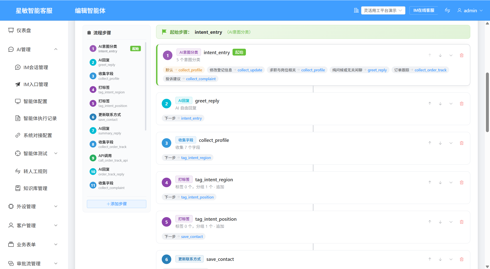

#### 5.6.5 AI 智能体执行记录

该模块用于记录 AI 执行过程和处理结果，便于查看命中情况、异常场景和优化依据。

核心价值：

- 让 AI 可观测
- 让问题可追踪
- 让优化有数据依据

#### 5.6.6 知识库管理

知识库管理用于统一沉淀标准问答、业务知识、处理口径和服务内容，是 AI 回答质量的重要底座。

它的价值在于：

- 统一服务口径
- 降低员工经验依赖
- 支撑智能体稳定输出

#### 5.6.7 转人工规则

转人工规则用于定义 AI 何时需要转交人工，例如高风险问题、重点客户、连续未解决场景等。

其价值在于让 AI 与人工形成高效协作，而不是相互替代或相互割裂。

**配图建议：**

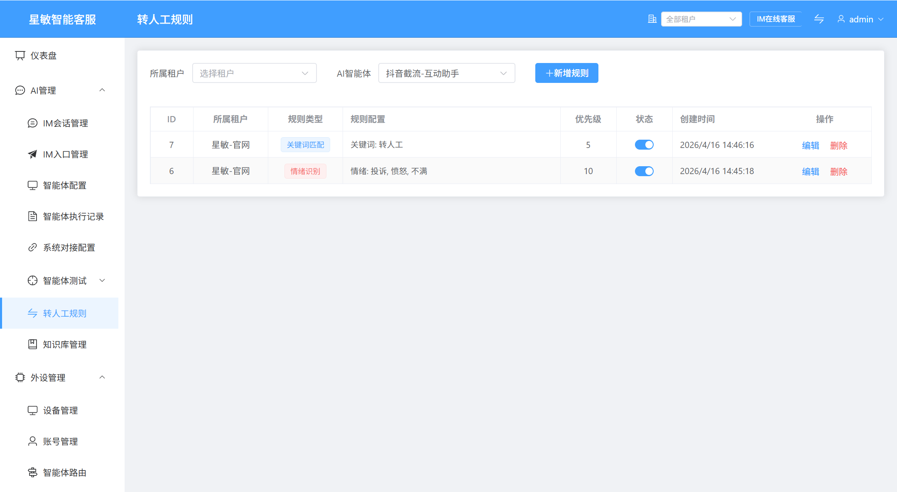

#### 5.6.8 设备管理

设备管理主要用于管理企业运行微信、企微等渠道账号的设备资源，适合多设备、多账号、多渠道协同场景。

其价值在于为渠道化接入、账号统一管理和设备状态维护提供基础。

#### 5.6.9 账号管理

账号管理用于维护不同设备上的服务账号，并与渠道好友、客户关系、服务策略进行关联。

适合在需要多账号协同、分流和归属管理的场景中使用。

#### 5.6.10 智能体路由

智能体路由用于根据入口、客户属性、标签、类型等规则，把不同请求自动分配给更合适的智能体。

这一能力让平台能够做到：

- 不同业务不同接待策略
- 不同客户不同服务路径
- 不同渠道不同智能体分工

#### 5.6.11 插件配置与渠道接入

该部分能力用于支撑微信、企业微信、插件页、嵌入页等渠道接入。

其价值在于：

- 统一渠道接入协议
- 支撑 OAuth、签名、初始化与消息链路
- 让系统能够嵌入到更多业务入口中

#### 5.6.12 系统对接配置

系统对接配置用于维护外部系统的对接档案，供工作流、智能体或业务流程复用。

它主要解决的是：

- 第三方接口鉴权方式多样
- 外部系统基址和环境复杂
- 敏感信息不适合直接写入流程配置
- 运营人员手工配置接口成本高

该模块的价值在于让平台更容易接入外部 SaaS、企业内部系统或开放平台，形成更完整的业务联动能力。

从页面能力看，系统对接配置并不是简单维护一个接口地址，而是把“系统连接方式”沉淀为一份可复用的对接档案。运营或实施人员可以在这里统一维护：

- 对接编码、名称、备注、环境、Base URL 等基础信息
- 默认请求头、公共参数、超时和连接策略
- API Key、Bearer、Basic、OAuth2 等常见鉴权方式
- 供工作流或智能体节点直接引用的标准化连接配置

结合当前页面设计，该模块还支持通过 `AI 识别接口文档` 的方式辅助建档。用户可以粘贴 OpenAPI 片段、Markdown 接口说明或 cURL 示例，由系统识别出接口基础信息并自动填充表单草稿，减少手工理解文档和逐项录入的成本。

这项能力特别适合以下场景：

- 企业需要接入第三方 SaaS、开放平台或内部业务系统
- 工作流中的 `api_call` 节点需要统一复用同一套连接参数
- 不同租户或不同环境需要维护独立的测试、预发、生产配置
- 希望把敏感信息从流程 JSON 中剥离，降低配置出错和泄露风险

从业务价值上看，系统对接配置相当于为平台增加了一层“标准连接底座”：

- 让接口接入从开发临时写死，转为后台可维护、可复用
- 让 AI、工作流、业务表单和外部系统之间更容易形成联动
- 让后续扩展报价、订单、CRM、TMS、资料平台等场景时更高效

**配图建议：**

下图展示 `系统对接配置` 的编辑页面，可体现 AI 识别接口文档、基础档案信息维护和对接环境配置等核心能力。

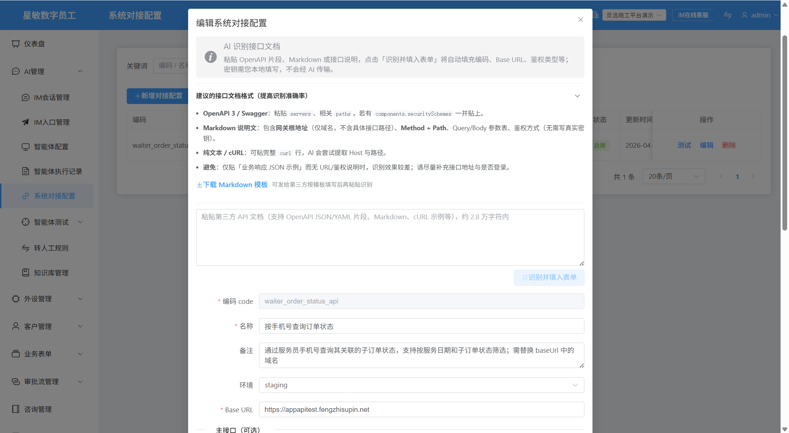

#### 5.6.13 IM 租户管理

IM 租户管理用于支撑多租户环境下的平台配置与隔离管理。

这一能力适合 SaaS 化运营和私有化项目交付，确保不同租户在数据、配置和权限上相互隔离。

**配图建议：**

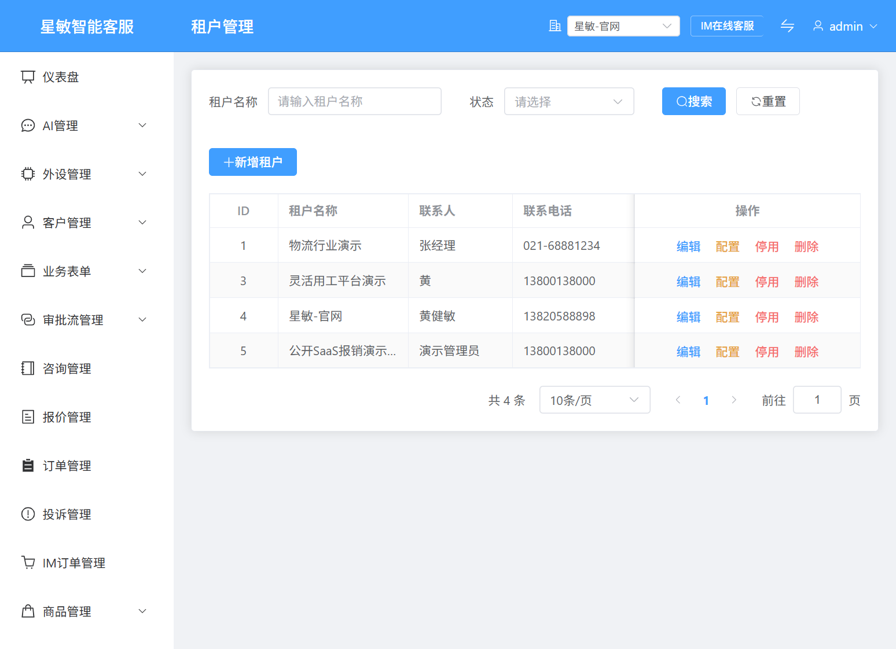

### 5.7 智能体测试

智能体测试模块用于验证智能体效果，支撑版本迭代、回归测试和持续优化。

主要包括：

| 子模块  | 作用说明                 |
| ---- | -------------------- |
| 测试用例 | 维护典型问题样本和标准输入输出      |
| 测试方案 | 组织用例集合，用于不同场景的批量测试   |
| 测试记录 | 查看每次测试执行结果、对比效果和评估得分 |

其价值在于让 AI 从“能用”走向“可验证、可比较、可持续优化”。

**配图建议：**

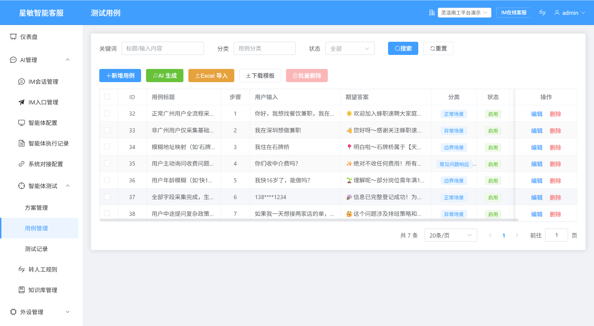

### 5.8 业务表单

业务表单模块承担结构化数据采集、模板化承载、业务单据生成和导出打印等能力。

主要包括：

| 子模块    | 作用说明           |
| ------ | -------------- |
| 业务单据   | 承接结构化业务信息和实例记录 |
| 打印模板管理 | 维护打印和导出版式      |
| 动态表单配置 | 配置字段、规则和表单结构   |
| 导出记录   | 留痕导出过程和结果      |

这一模块的核心价值在于把聊天过程中的信息收集、业务确认和资料输出，转化为标准化、可流转的业务数据能力。

**配图建议：**

下图展示打印模板编辑与预览效果，适合体现业务单据模板化输出能力。

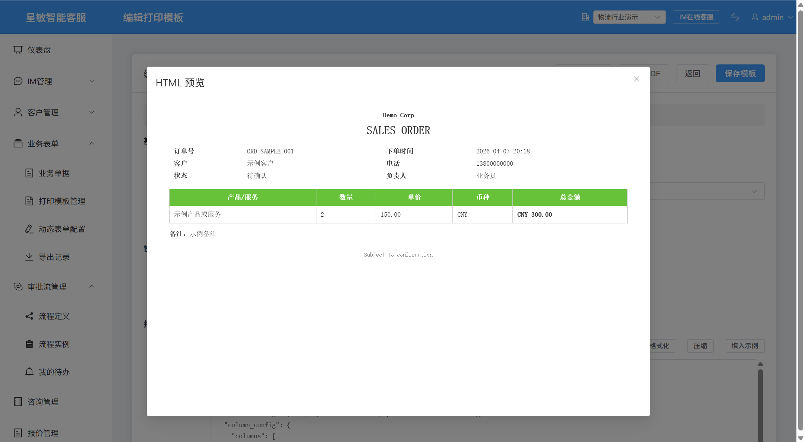

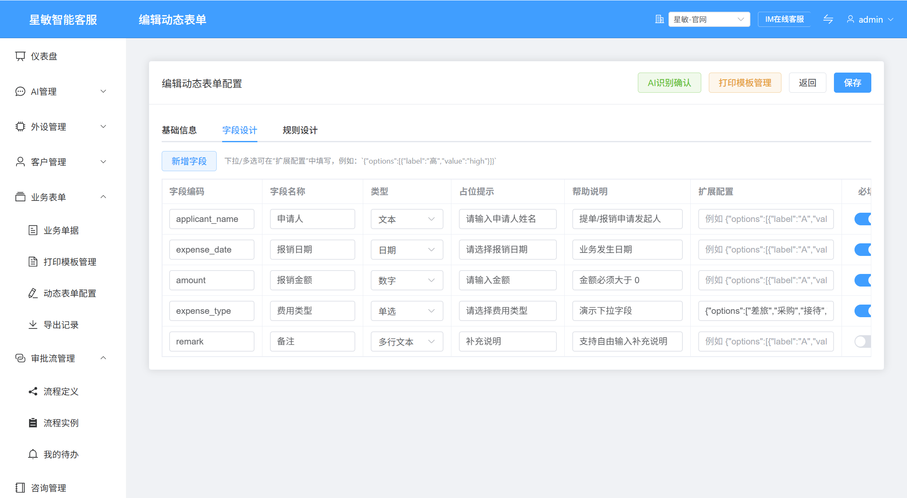

### 5.9 审批流管理

审批流管理用于打通内部协同和流程推进，适合报价、申请、权限、表单等需要审批的场景。

主要包括：

| 子模块  | 作用说明          |
| ---- | ------------- |
| 流程定义 | 配置审批流程和处理规则   |
| 流程实例 | 查看流程执行进度和处理状态 |
| 我的待办 | 集中处理个人待审批事项   |

该模块的价值在于：

- 让协同从线下传递走向线上推进
- 让审批过程有记录、有状态、有责任归属
- 让服务和业务真正形成闭环

**配图建议：**

下图展示流程定义与节点编排界面，适合说明审批规则的配置方式。

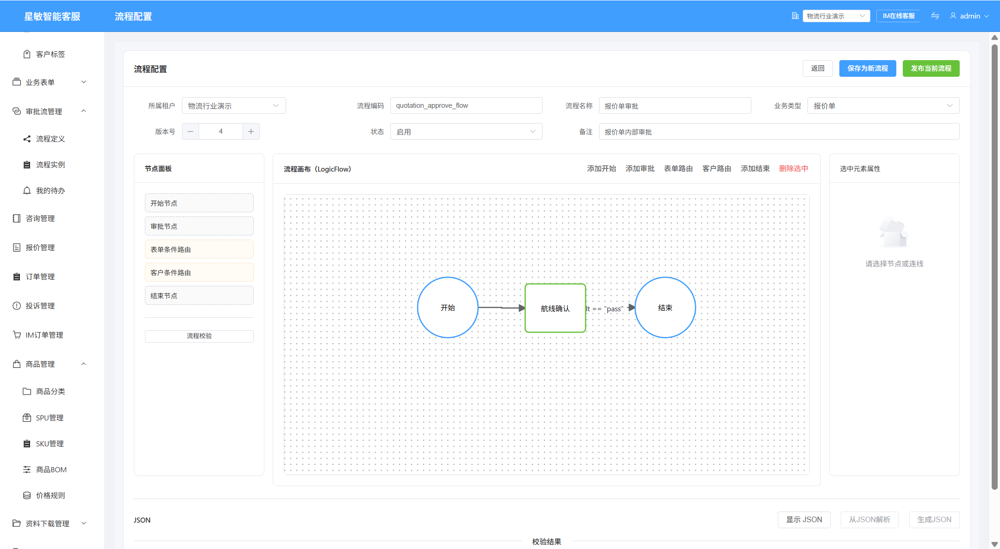

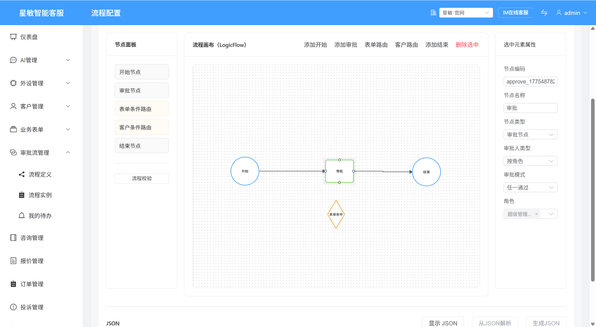

下图展示 PC 端待办详情页面，适合体现审批实例的处理信息与业务字段联动。

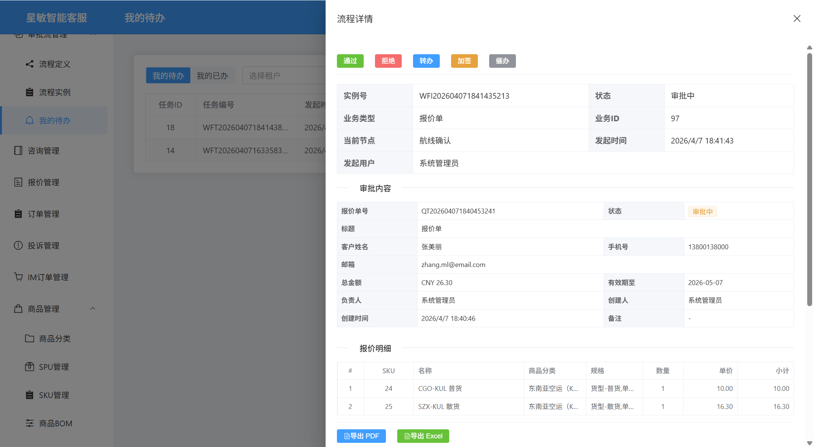
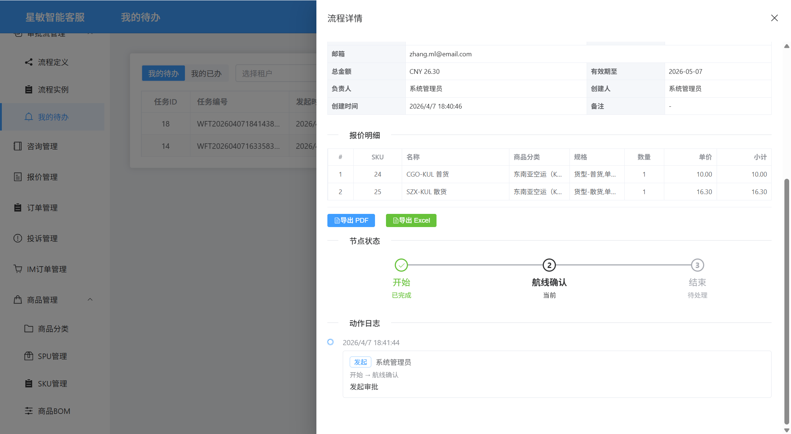

下图展示移动端审批中心与审批详情，适合体现移动审批和导出场景。

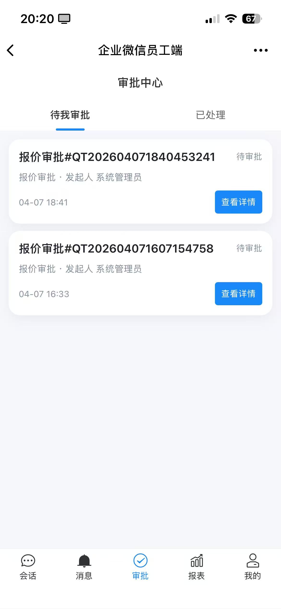
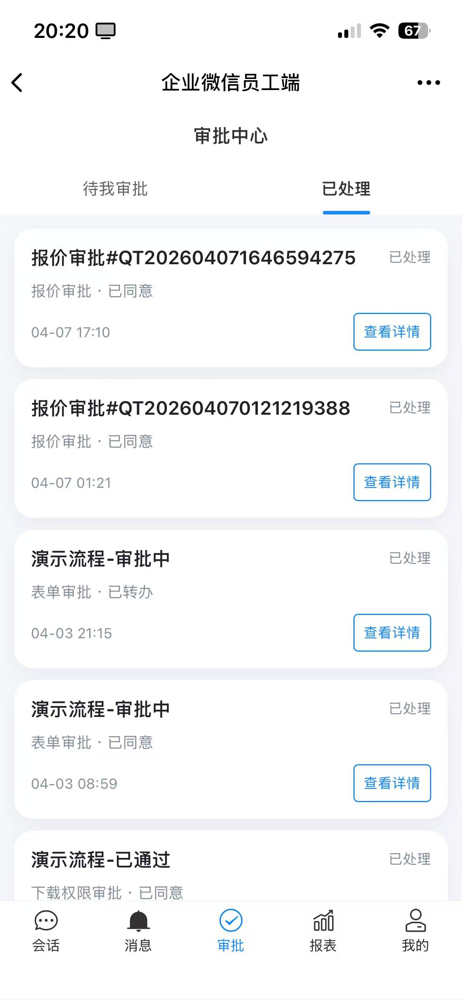
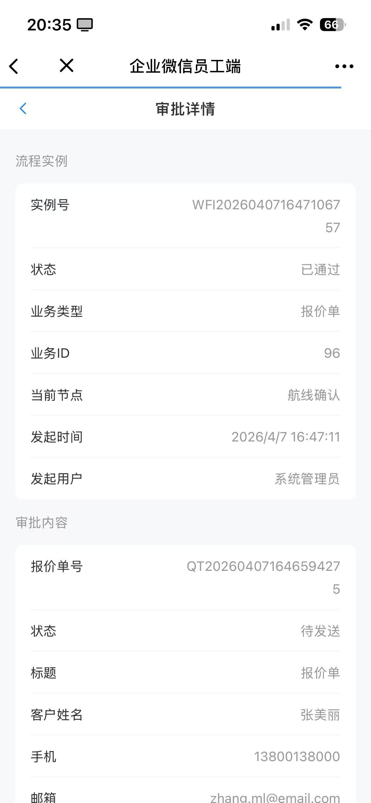
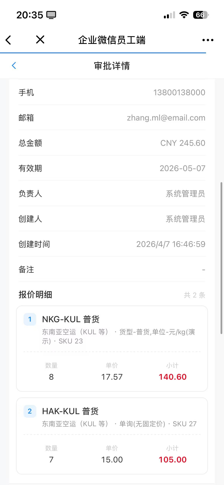
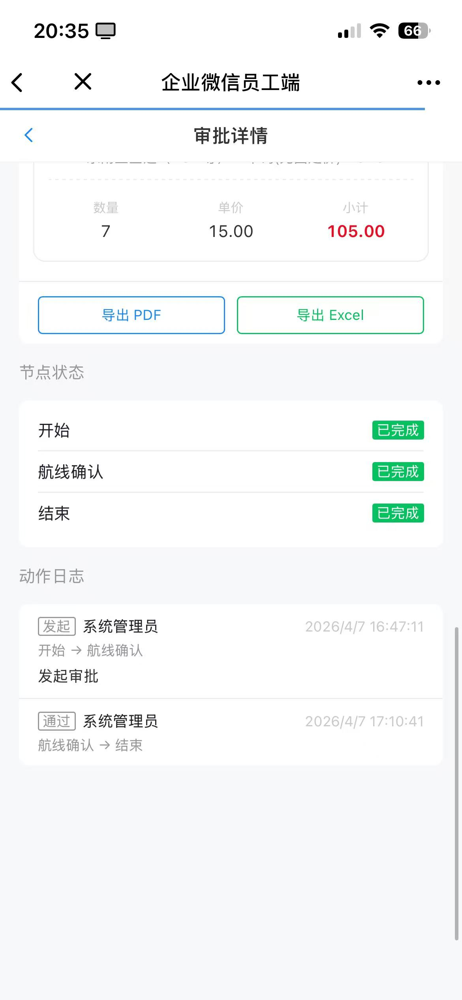

### 5.10 可扩展业务模块

可扩展业务模块体现的是星敏数字员工的平台延展能力，不同行业客户可以根据实际需要启用对应模块。

典型包括：

| 子模块     | 作用说明                     |
| ------- | ------------------------ |
| 报价管理    | 维护报价单、报价明细、报价流程和客户报价输出   |
| IM 订单管理 | 承接与会话场景相关的订单处理           |
| 订单管理    | 统一查看和管理订单业务              |
| 商品管理    | 管理商品分类、SPU、SKU、BOM、价格规则等 |
| 资料下载管理  | 维护资料分类、资料权限和下载申请         |
| 线索类模块   | 适合特定场景下的线索收集、候选管理、设备日志等  |

这些模块的价值不在于把系统定义成某一个垂直 ERP，而在于证明平台具备面向行业场景延展、与业务深度联动的能力。

如果进一步拆分展示，可按以下业务场景理解：

| 细分场景 | 典型页面/模块 | 场景价值 |
| --- | --- | --- |
| 报价与订单协同 | 报价列表、报价编辑、IM 订单管理、订单详情 | 把客户咨询、业务确认、报价输出和订单承接串联起来 |
| 商品与价格体系 | 商品分类、SPU、SKU、BOM、价格规则 | 支撑标准化商品管理、快速选品和价格策略配置 |
| 资料与权限协同 | 资料分类、资料管理、权限申请审批、用户权限管理 | 让资料发放、下载权限和审批动作形成闭环 |
| 线索与增长场景 | 截流关键词任务、线索候选、设备日志 | 适合特定业务场景下的线索沉淀、识别和后续跟进 |

如果以“报价单”作为代表场景来看，这套扩展能力的逻辑并不是单纯做一个录单页面，而是围绕“客户 -> SKU -> 价格 -> 审批/发送”形成完整闭环。

首先，销售或客服人员会从 `报价列表` 进入报价流程。列表页不仅用于查看历史报价，还承担以下管理作用：

- 查看每张报价单的客户、租户、标题、总金额和当前处理状态；
- 区分草稿、待审批、已发送、已驳回等不同阶段；
- 对已有报价继续执行查看、编辑、提交审批、撤回、删除等动作；
- 让团队可以按客户或报价单号快速回看历史报价记录，避免重复建单和重复沟通。

进入 `报价编辑页` 后，页面会先锁定本次报价所对应的客户上下文，例如客户名称、客户类型、标签、有效期等，再围绕“报价明细”组织后续操作。这里的核心思路是：报价并不是手工从零输入一串价格，而是先确定客户，再把 SKU 明细批量组织进来，再由规则价、历史价或人工调整共同形成最终报价。

在 SKU 加入方式上，系统支持多种录入路径，适合不同业务习惯：

- `文本粘贴`：适合业务员直接把 SKU 编码、名称或整理后的文本清单粘贴进系统，快速解析并匹配；
- `图片识别`：适合把客户发来的截图、清单照片、表格截图直接上传，由系统识别后匹配 SKU；
- `Excel 导入`：适合一次性导入大量商品，系统读取首个工作表后批量匹配 SKU 与数量。

这些批量导入方式的关键并不只是“导进来”，而是系统会先给出 `匹配结果`，明确告诉用户哪些行匹配成功、对应到了哪个 SKU、数量是多少、失败项是什么原因。这样用户不需要手工逐条排查，可以在确认后把成功项一次性加入报价明细，大幅提升大批量报价场景下的处理效率。

当明细进入报价单后，系统会进入真正的“取价与调价”环节。这里体现出报价逻辑的几个重要层次：

1. **历史价格复用**  
通过 `历史报价 SKU` 弹窗，可以查看该 SKU 在历史报价中的成交或报价记录，包括数量、单价、来源报价单和报价时间。这样做的价值是让业务员在面对老客户、重复线路、常见商品时，可以优先参考历史成交口径，避免每次重新判断。

2. **规则价格自动带入**  
系统支持“全部按规则取价”等动作，说明报价并不完全依赖人工输入，而是可以基于客户类型、客户标签、SKU 标准价或成本价等规则自动计算建议价格。这样既能统一报价口径，也能降低人员经验差异带来的波动。

下图分别展示 `SKU 标准价` 与 `价格规则` 页面，可辅助说明标准价底座和规则取价机制。

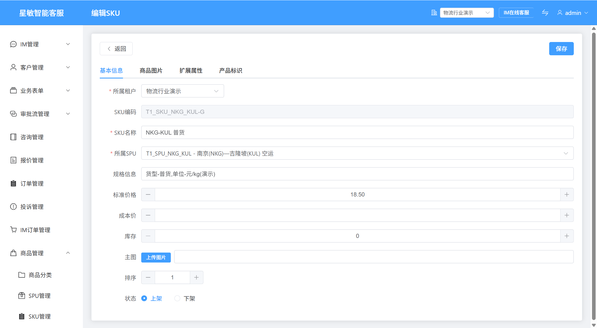

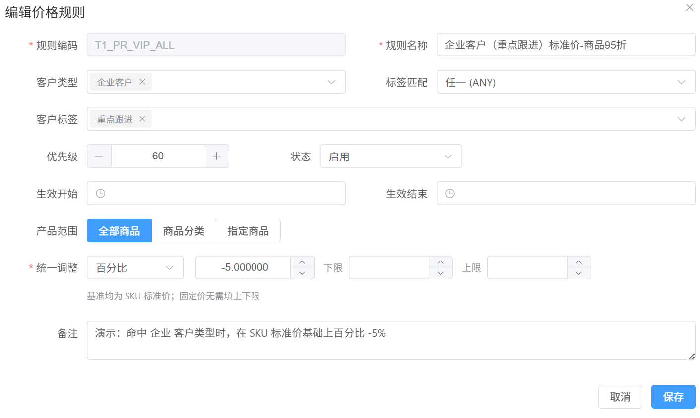

3. **按分类批量改价**  
当客户提出统一调价要求时，不需要逐行修改。系统支持按商品分类统一调整比例，例如某一类线路整体上浮或下调一定百分比，并把调整结果直接应用到当前已选明细中。这个能力非常适合物流、贸易、批发等同类商品较多的报价场景。

4. **单行人工修正**  
在规则价和批量改价基础上，业务员仍然可以对单行价格做补充修正，以适配特殊客户、特殊线路、临时策略或业务判断。也就是说，系统不是强行用规则替代人，而是在“规则统一口径”和“人工灵活处理”之间取得平衡。

整个报价单的业务路径通常可以概括为：

1. 在 `报价列表` 中创建或进入一张报价单；
2. 选择客户，带出客户类型、标签、历史上下文；
3. 通过文本粘贴、图片识别、Excel 导入或手工新增，把 SKU 明细快速组织进来；
4. 结合历史报价、规则价格和批量调价能力，形成当前客户的本次报价；
5. 由业务员补充备注、标题、有效期等信息；
6. 报价单生成后进入提交审批、发送客户或后续转订单等环节。

从这个角度看，报价管理模块的核心价值不只是“生成一张价格单”，而是把客户识别、商品匹配、价格策略、批量处理和审批发送整合成一个可复用、可追踪、可协同的标准流程。对于 SKU 数量多、客户差异大、报价频率高的团队，这种流程化能力会显著提升效率和一致性。

如果需要进一步从业务视角展示整体流转关系，可补充以下报价审批流程图，帮助客户理解从发起报价、规则匹配到审批确认和同步外部系统的完整链路。

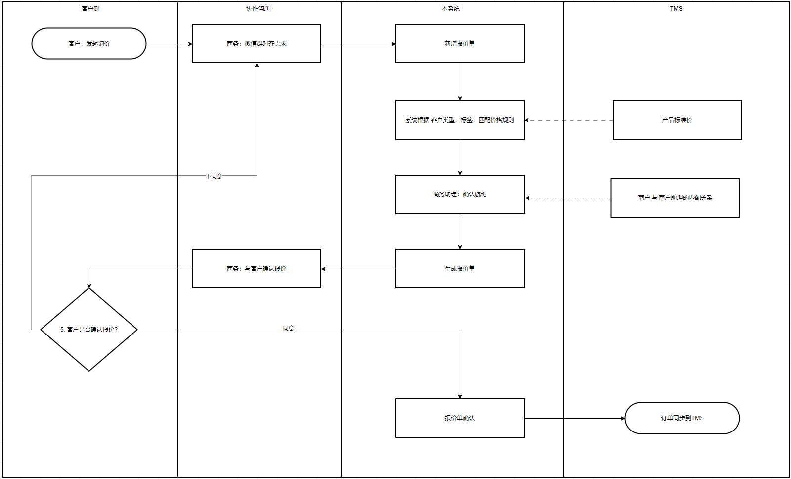

**配图建议：**

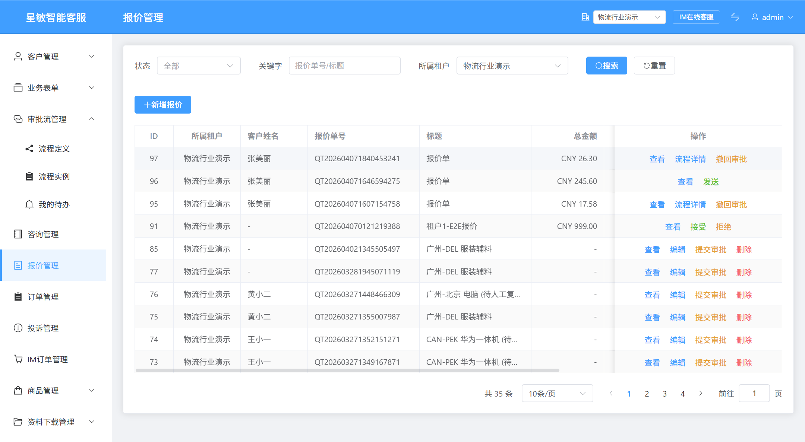
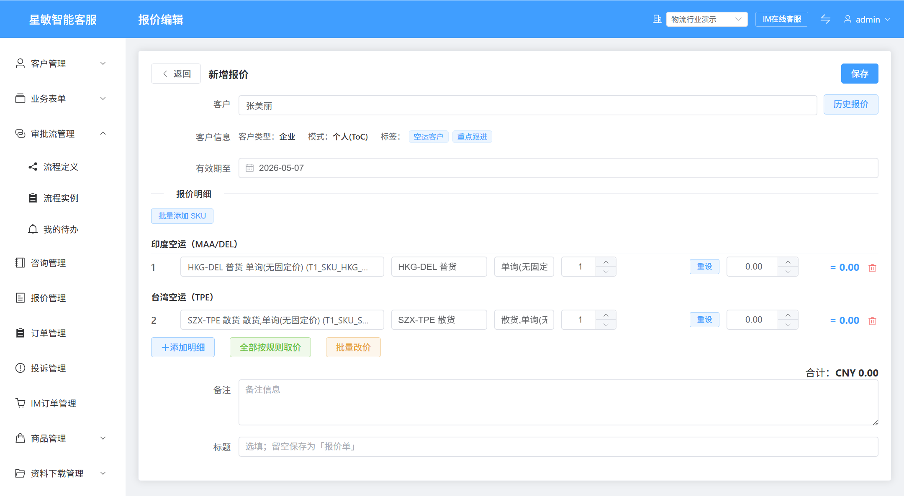
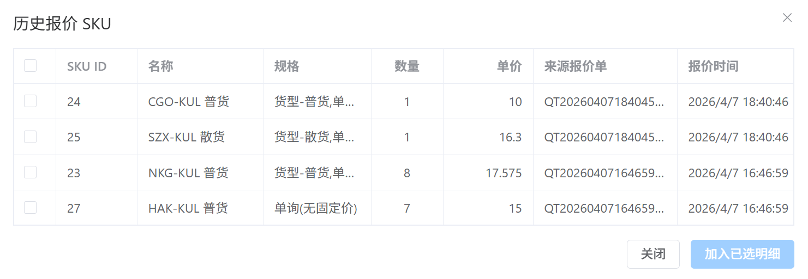
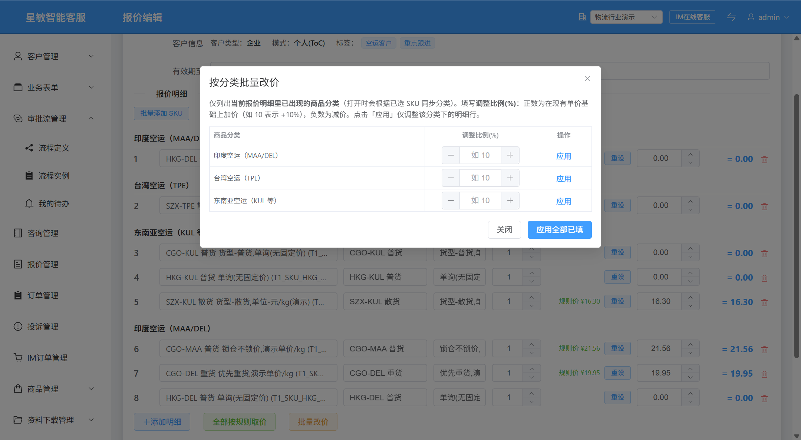
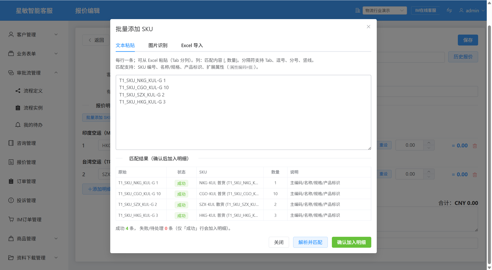
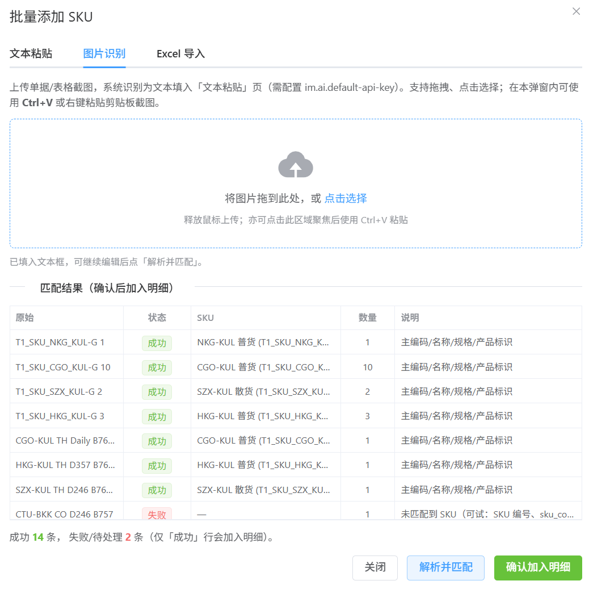
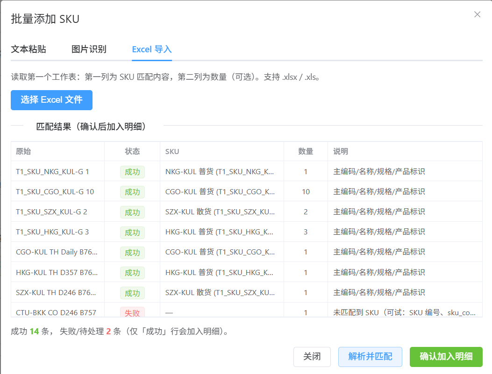

***

## 六、系统核心亮点

### 6.1 统一前后台协同

星敏数字员工将客户入口、会话处理、客户主档、表单、审批、报价、资料等能力统一在同一平台中，避免企业在多个工具之间频繁切换。

### 6.2 AI 与人工真正协同

系统不是简单用 AI 替代人工，而是通过知识库、规则、路由、转人工和实时工作台，让 AI 和人工在统一机制中协同工作。

### 6.3 配置化、可扩展

无论是智能体、知识、工作流、路由、表单还是业务规则，系统都强调配置化建设，便于后续行业化扩展和持续迭代。

### 6.4 客户资产持续沉淀

从客户接入、会话过程到后续单据、审批和业务动作，关键数据都可以沉淀下来，形成企业长期可经营的数字资产。

### 6.5 适合多角色长期使用

客服、销售、运营、主管、管理员等不同角色都可以在同一系统中找到对应工作界面，适合长期运营和复制推广。

***

## 七、客户可获得的价值

| 价值维度 | 可见收益                   |
| ---- | ---------------------- |
| 服务效率 | 客户咨询响应更快，高峰期承接能力更强     |
| 服务质量 | 知识统一、规则清晰、处理更标准        |
| 协同效率 | AI、人工、客户信息和流程在一个平台内协同  |
| 管理能力 | 过程可留痕、结果可复盘、责任可追踪      |
| 经营能力 | 客户数据持续沉淀，支持后续分层运营和转化   |
| 扩展能力 | 可逐步延伸到报价、订单、商品、资料等业务场景 |
| 平台能力 | 支持多角色、多租户、多入口长期使用      |

***

## 八、实施建议

### 8.1 建设路径建议

建议按照“先核心、后扩展；先接待、后协同；先闭环、后深化”的思路推进：

**第一阶段：核心智能服务能力落地**

- 首页看板
- IM 在线客服
- 智能体配置
- 知识库管理
- 转人工与路由
- 客户信息

**第二阶段：流程协同与客户运营建设**

- 客户标签
- 联系任务
- 咨询与投诉管理
- 业务表单
- 审批流管理

**第三阶段：行业化扩展与平台深化**

- 报价管理
- 商品与价格规则
- 资料下载管理
- 渠道化接入深化
- 外部系统对接

这样既能保证项目快速见效，也有利于企业按实际业务节奏逐步放大平台价值。

### 8.2 实施原则

为了保证项目顺利落地，建议遵循以下原则：

- 以真实服务场景为牵引，而不是只堆功能
- 先把知识、规则和流程口径统一，再谈自动化
- 优先建设高频、可复制、能快速见效的模块
- 保留人工兜底和过程控制，确保服务质量可控
- 平台定位先明确为“星敏数字员工”，行业能力按需逐步扩展

***

## 九、预期成效

项目落地后，企业通常可在以下方面看到明显改善：

- 客户咨询响应速度明显提升
- AI 与人工协同效率更高
- 常见问题处理更加标准和稳定
- 客户资料和服务过程持续沉淀
- 内部协同更顺畅，待办更集中
- 服务过程更透明，管理更可控
- 为后续客户运营和业务扩展提供统一平台基础

从长期看，星敏数字员工将帮助企业逐步建立一套可复制、可管理、可持续优化的智能服务体系，为服务升级、运营提升和平台化发展提供支撑。

***

## 十、结语

星敏数字员工的价值，不只是“让回复更快”，而是帮助企业建立一套 **可接待、可协同、可沉淀、可扩展** 的数字化服务体系。

它既可以从智能服务切入，也可以逐步向客户经营、业务协同和行业化平台能力扩展，适合希望长期建设企业数字化服务能力的客户。

***

*联系人：黄健敏 | 电话：18620588898*
