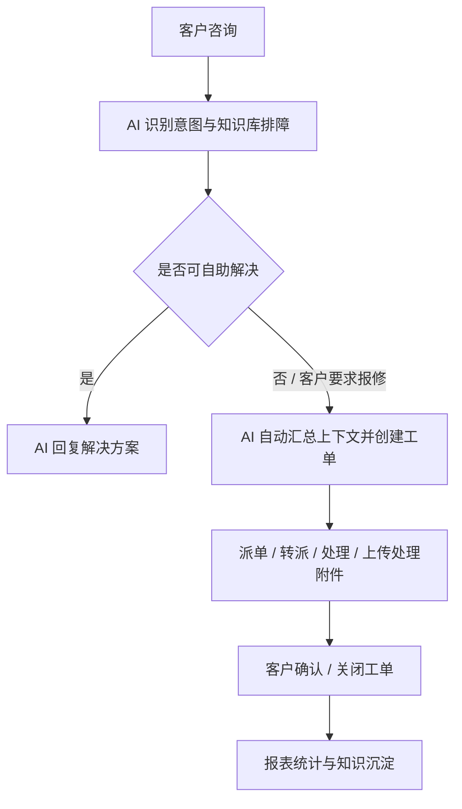
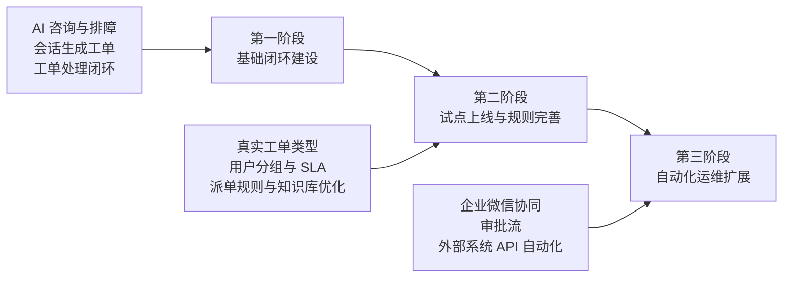

# IT 运维小助手需求应对方案

本方案基于星敏数字员工平台，建设“AI 咨询 + 引导排障 + 工单闭环 + 服务报表”的智能化 IT 运维服务中心，帮助企业降低重复咨询成本、提升 IT 服务响应效率，并形成可追踪、可统计、可持续优化的运维服务体系。

## 1. 项目背景

随着企业内部系统数量增加，IT 运维团队通常会面临以下问题：

- 员工咨询入口分散，问题容易散落在电话、群聊、私信和邮件中。
- 密码、VPN、系统登录、权限申请等高频问题重复出现，人工解答成本高。
- 客户提交问题时信息不完整，工程师需要反复追问错误提示、截图、影响范围等上下文。
- 工单流转过程不透明，客户难以及时了解进展，管理者也难以追踪服务质量。
- SLA、工程师效率、AI 解决率等指标缺少统一统计，IT 服务价值不易量化。

本方案建议基于现有“星敏数字员工平台”扩展建设 IT 运维小助手，不从零开发独立系统。平台已具备 IM 会话、AI 智能体、知识库、工单管理、附件上传、派单规则、SLA、报表等基础能力，可快速形成一套面向 IT 运维场景的服务闭环。

## 2. 建设目标

本项目目标不是单纯建设一个聊天机器人，而是建设一套“可咨询、可排障、可建单、可处理、可追踪、可统计”的 IT 运维服务体系。

核心建设目标包括：

1. 建立统一 IT 咨询入口，支持自然语言提问、图片、截图和文件提交。
2. 通过 AI 智能体和知识库优先解决常见问题，减少人工重复解答。
3. 对无法自助解决的问题，自动或手动生成工单，进入标准处理流程。
4. 工单支持派单、转派、处理、附件反馈、客户确认、关闭和重开。
5. 技术人员可从工单直接进入客户会话，继续沟通并发送处理文件。
6. 建立工单类型、用户分组、SLA 和派单规则，适配不同运维团队。
7. 建立 IT 运维报表，量化会话量、工单量、AI 解决率、处理效率和 SLA 达成情况。
8. 为后续对接密码重置、账号开通、权限查询等第三方系统 API 预留扩展能力。

## 3. 方案全景

系统整体采用“AI 前置处理 + 工单闭环管理 + 数据运营分析”的架构。

客户通过 IM 会话提交问题后，AI 小助手会先识别问题意图：

- 如果是常见咨询，AI 直接给出知识库答案或引导式排障步骤。
- 如果需要工程师处理，AI 自动汇总上下文并创建工单。
- 如果客户继续补充错误码、截图或其他信息，系统可更新已有工单。
- 如果客户表示问题已解决或不再需要处理，系统可关闭或更新工单。
- 工单处理过程中，工程师可进入会话继续沟通，并将处理附件发送给客户。

整体流程如下：

## 4. 核心功能说明

### 4.1 AI 智能问答与自助排障

AI 小助手可作为 IT 服务的一线入口，对常见问题进行自动识别和回复。

主要能力：

- 支持密码、VPN、ERP/OA 登录、权限申请、网络异常等常见问题咨询。
- 支持根据知识库回答标准问题，降低人工重复解答。
- 支持引导式排障，按步骤收集系统名称、错误码、影响范围、截图等信息。
- 支持动态分支判断，根据客户回答决定继续排障、转人工或创建工单。
- 支持文本、图片和文件等多类型消息。

### 4.2 AI 自动创建与更新工单

当客户明确要求报修，或 AI 判断问题需要工程师介入时，系统可自动创建工单。

主要能力：

- AI 自动总结客户问题，生成工单标题、问题描述、类型和优先级。
- 自动关联客户、会话、语言、截图和文件附件。
- 自动返回准确工单号，便于客户后续追踪。
- 客户补充错误码、截图或处理要求时，可更新当前会话已有工单，避免重复建单。
- 客户表示“问题已解决”“不用处理了”时，可触发工单关闭或状态更新。

### 4.3 专业工单管理

系统提供完整工单管理后台，支持从 AI 会话、人工客服和后台手动创建工单。

工单核心字段包括：

- 工单编号、标题、问题描述。
- 工单类型、优先级、状态、来源。
- 客户、当前处理人、关联会话。
- 要求完成时间、处理完成时间。
- 处理结果、附件、评论和操作时间线。

工单支持的主要状态包括：

- 待派单
- 待处理
- 处理中
- 待确认
- 已解决
- 已关闭
- 已取消
- 已挂起

系统可在工单列表中展示工单编号、标题、状态、类型、优先级、客户、处理人、要求完成时间、处理完成时间等信息，方便管理人员快速定位重点工单。

### 4.4 派单规则与 SLA 管理

系统支持按规则自动派单，减少人工分配成本。

派单规则可结合以下条件：

- 工单类型
- 优先级
- 客户类型
- 客户标签
- 客户语言
- 用户分组
- 默认处理人

SLA 管理支持配置不同类型、不同优先级、不同客户类型下的响应和解决时限。系统可根据规则自动计算工单要求完成时间，并在列表和详情中展示 SLA 状态。

### 4.5 技术人员高效工作台

工单详情页以多 Tab 方式展示完整处理上下文：

- 内容：展示问题描述、处理结果、附件与截图。
- 时间线：展示创建、派单、转派、处理、确认、关闭等完整过程。
- 评论：支持内部说明和客户可见说明。
- 关联会话：直接查看客户原始会话内容。
- 附件：支持图片预览和文件打开。

技术人员处理工单时，可从工单列表或详情点击进入关联会话，与客户继续沟通。处理过程中上传的修复说明、配置文件或截图，可同步保存为工单附件，并推送到客户会话中。

### 4.6 工单配置能力

系统提供工单基础配置能力，便于客户根据自身组织情况维护数据。

支持：

- 工单类型配置，例如账号问题、密码问题、网络问题、系统故障、权限申请等。
- 用户分组配置，例如桌面支持组、网络支持组、系统运维组、权限管理组等。
- 用户组成员维护，支持显示用户编号、账号和用户名称。
- SLA 标准配置，支持按工单类型、优先级、客户类型设置时限。

### 4.7 数据报表与运营分析

系统已提供 IT 运维报表聚合看板，帮助管理层从数据角度查看服务质量。

报表可关注：

- 会话量、工单量。
- AI 解决率、工单解决率。
- 超时工单数量。
- 工单类型分布。
- 优先级分布。
- 工程师处理效率。
- SLA 达成情况。

通过报表，IT 管理者可以识别高频问题、薄弱环节和人员负载情况，从而持续优化知识库、派单规则和服务流程。

## 5. 典型业务场景

### 5.1 自助排障：忘记密码

客户咨询“ERP 密码忘记了怎么办”。AI 先给出自助找回、验证码确认、账号锁定检查等建议。若客户仍无法解决，再引导提交工单。

客户价值：减少简单问题人工介入，降低 IT 支持压力。

### 5.2 自动报修：VPN 报错

客户反馈“VPN 一直报 809，我已经换网络和重装客户端了，帮我报修”。AI 判断需要工程师介入，自动创建网络/VPN 工单，并带入错误码和会话上下文。

客户价值：客户无需填写复杂表单，工程师接单时已有完整背景。

### 5.3 工单更新：补充错误码或截图

客户在同一会话中补充“刚才那个 VPN 工单补充一下，错误码是 809，截图已经发群里了”。系统识别为更新已有工单，而不是重复创建新工单。

客户价值：避免重复工单，提升处理准确性。

### 5.4 工程师处理：发送修复附件

工程师处理工单时上传修复说明、配置文件或截图。系统将文件保存到工单附件，并自动发送到客户会话。

客户价值：处理结果清晰送达，减少跨系统沟通成本。

### 5.5 客户提前关闭

客户表示“问题已经解决，不需要再处理了”。系统可识别该意图，并关闭或更新关联工单。

客户价值：流程自然闭环，不依赖人工反复确认。

## 6. 本系统优势

### 6.1 基于成熟平台扩展，交付周期更短

系统不是从零开发，而是在星敏数字员工平台上扩展 IT 运维场景。平台已有 IM、AI、知识库、文件、工单、报表等基础能力，可降低交付风险并缩短上线周期。

### 6.2 AI 与工单闭环结合，不只是聊天机器人

系统不仅能回答问题，还能把问题转化为工单，并完成派单、处理、反馈、客户确认和关闭。它解决的是完整服务流程，而不仅是问答。

### 6.3 会话上下文自动沉淀，减少重复沟通

系统会将客户原始描述、截图、附件、错误码和影响范围带入工单。工程师接单后可直接查看关联会话，减少反复询问。

### 6.4 技术人员可从工单直接沟通客户

工程师不需要在工单系统和聊天系统之间手动查找客户，点击工单即可进入关联会话继续沟通，并可把处理文件直接发给客户。

### 6.5 可配置化适配客户组织

工单类型、用户分组、派单规则和 SLA 均可配置，能够适配不同客户的组织结构和服务规则。

### 6.6 全程留痕，可审计可追溯

工单创建、派单、转派、处理、确认、关闭、附件上传和 AI 工作流动作均可形成记录，便于审计和复盘。

### 6.7 先闭环，后自动化

系统可以先完成咨询和工单闭环，再逐步对接外部 API，实现密码重置、账号开通、权限查询等自动化动作，避免一次性建设过重。

## 7. 实施路径

建议采用“三阶段”方式推进，先形成业务闭环，再逐步提升自动化能力。

### 第一阶段：基础闭环建设

目标：完成从客户咨询、AI 排障、创建工单、派单处理、客户确认到报表查看的完整流程。

主要内容：

- 确认客户 IT 运维场景和基础业务规则。
- 配置 IT 运维小助手、工单类型、用户分组和基础 SLA。
- 打通会话生成工单、更新工单、关闭工单。
- 打通工单处理、上传附件、进入会话沟通。
- 建立基础报表看板。

### 第二阶段：试点上线与规则完善

目标：将系统接入客户真实试点团队，配置真实规则并收集效果。

主要内容：

- 配置真实工单类型、处理组、人员和派单规则。
- 配置真实 SLA 标准。
- 补充高频问题知识库和排障流程。
- 按试点数据优化流程和报表。

### 第三阶段：自动化运维扩展

目标：对接客户外部系统 API，逐步实现高频运维动作自动化。

主要内容：

- 对接密码重置、账号开通、权限查询等接口。
- 对高风险动作接入审批、二次确认和审计。
- 建立失败重试、人工兜底和异常告警机制。
- 扩展企业微信移动处理和通知闭环。

## 8. 预期收益

### 8.1 效率收益

- 高频简单问题由 AI 和知识库处理，预计减少 30% 到 50% 的人工咨询量。
- AI 自动收集会话上下文和附件，预计减少 20% 到 40% 的工单往返沟通。
- 工程师从工单一键进入会话，缩短客户沟通链路。
- SLA 和派单规则降低遗漏和延迟，预计响应效率提升 30% 以上。

### 8.2 管理收益

- 服务过程可量化：从“谁处理了什么”升级为“处理效率、质量、解决率可统计”。
- 经验可沉淀：高频问题进入知识库，持续提升 AI 解决率。
- 风险可控制：敏感操作可接入审批和审计，避免越权或误操作。
- 组织可扩展：通过派单规则、用户分组和 SLA 支撑多团队、多语言、多客户类型服务。

### 8.3 交付成果

项目交付后可形成以下成果：

- IT 运维小助手 AI 智能体。
- IT 运维工单管理后台。
- 工单类型、用户分组、SLA 和派单规则配置。
- 会话生成工单、更新工单、关闭工单能力。
- 工单附件、截图和处理文件能力。
- 关联会话查看和进入会话沟通能力。
- 工单状态流转和操作时间线。
- IT 运维报表看板。
- 部署文档、使用说明和培训材料。

