# 星敏数字员工-IT 运维中心系统介绍

IT 运维中心基于星敏数字员工平台建设，面向企业内部 IT 服务场景，提供“智能咨询、引导排障、工单处理、配置管理、数据报表”的一体化能力。系统将员工日常 IT 咨询入口、AI 自助服务、人工工单处理和管理报表整合到同一平台中，帮助 IT 团队提升响应效率、规范服务流程，并沉淀可持续优化的数据资产。

## 1. 系统定位

IT 运维中心不是单一的问答机器人，也不是孤立的工单系统，而是一套覆盖 IT 服务全流程的数字化运营平台。

系统主要解决以下问题：

- 员工 IT 问题入口分散，咨询记录难以统一沉淀。
- 高频问题重复咨询，占用 IT 工程师大量时间。
- 报修问题描述不完整，工程师需要反复追问。
- 工单派发、处理、反馈和关闭过程不够透明。
- IT 服务质量缺少统一指标，管理者难以评估服务效率。

通过 IT 运维中心，企业可以建立统一的 IT 服务入口，将咨询、排障、建单、派单、处理、确认、关闭、统计分析形成完整闭环。

## 2. 系统功能总览

系统功能可分为三大部分：

1. 业务流程：覆盖客户咨询、AI 排障、工单创建、派单处理、客户确认和服务闭环。
2. 配置功能：支持工单类型、用户分组、派单规则、SLA、排障流程等基础规则配置。
3. 系统报表：统计会话、工单、AI 解决率、SLA、工程师效率等关键运营指标。
4. 多端接入：支持通过 JSSDK、系统链接、企业微信和移动端接入，嵌入到企业已有业务系统中。

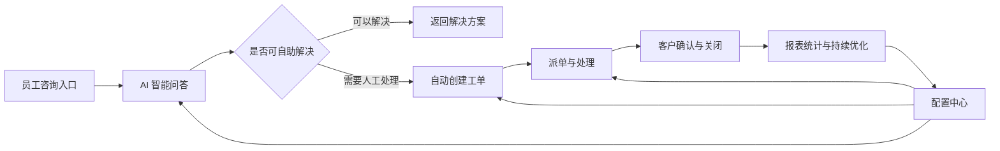

### 2.1 可接入方式

IT 运维中心可以作为独立入口使用，也可以嵌入到企业现有系统中，减少员工切换系统的成本。

可接入方式包括：

- JSSDK 接入：在 ERP、OA、门户、业务中台等 Web 系统中嵌入咨询入口，员工无需离开当前业务页面即可发起 IT 咨询。
- 页面链接接入：通过菜单、按钮、帮助中心、系统公告等方式跳转到 IT 运维小助手。
- 企业微信接入：通过企业微信消息、应用入口或通知卡片触达员工和处理人员。
- 移动端接入：技术人员或客服可在手机端查看工单、回复会话、处理问题和查看运维报表。
- API 扩展接入：后续可对接密码重置、账号开通、权限查询等外部系统接口，实现自动化处理。

第三方系统可以在业务页面中直接发起咨询，适合嵌入 ERP、OA、门户系统、内部工具平台等场景。

| 第三方系统发起咨询入口-引导式排障流程 | 第三方系统发起咨询入口-生成工单 |
| --- | --- |
| 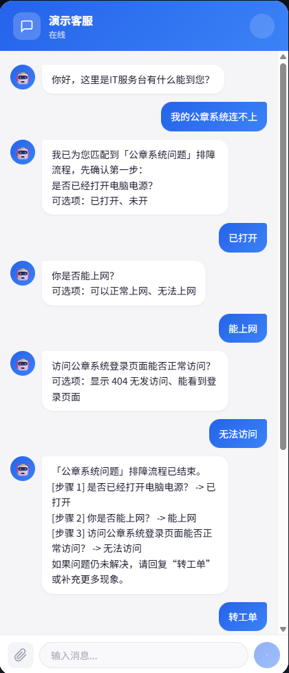 | 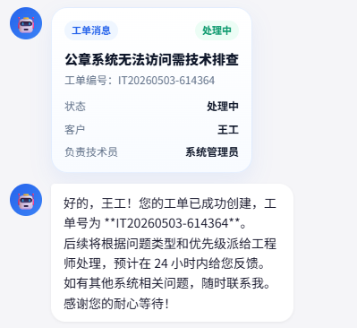 |

## 3. 业务流程

### 3.1 统一咨询入口

员工可以通过会话入口提交 IT 咨询或故障报修，支持文字、图片、截图、文件等多种消息形式。AI 小助手作为一线服务入口，优先识别员工问题类型，并结合知识库或排障流程给出处理建议。

典型咨询包括：

- 账号、密码、验证码、账号锁定等登录问题。
- VPN、网络、打印机、办公设备等环境问题。
- ERP、OA、企业微信、邮箱等业务系统使用问题。
- 权限申请、系统开通、数据访问等流程类问题。

### 3.2 AI 智能问答与引导排障

对于常见问题，AI 小助手可直接根据知识库回答；对于需要进一步确认的信息，系统可通过引导式排障流程逐步收集关键字段，例如系统名称、错误提示、截图、影响范围、发生时间等。

引导式排障适合处理“员工不知道该怎么描述问题、工程师需要反复追问”的场景。系统会把传统人工追问过程整理成标准步骤，由 AI 在会话中自动引导员工逐项确认，既能提升员工自助解决体验，也能让后续工单信息更完整。

引导式排障通常包括以下过程：

- 识别问题类型：先判断员工咨询的是账号、网络、系统登录、权限、设备还是其他问题。
- 收集必要信息：根据问题类型要求员工补充系统名称、账号、错误提示、截图、发生时间、影响范围等信息。
- 给出排障建议：结合知识库或预设流程，返回重试、检查、清理缓存、切换网络、确认权限等处理步骤。
- 判断是否解决：员工反馈已解决时结束会话；仍未解决时继续排障或创建工单。
- 自动带入工单：如果需要人工处理，系统将前面收集的信息、截图和排障记录一起带入工单。

这一阶段的目标是让简单问题在会话中直接解决，让复杂问题在进入工单前尽可能补齐上下文，减少工程师接单后的重复沟通。

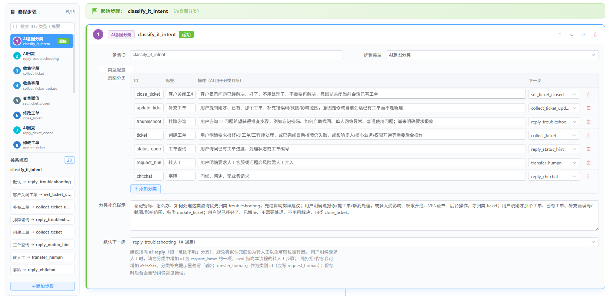

系统也可以对 AI 的自动化能力进行测评，验证智能体在识别问题、创建工单、更新工单、关闭工单等关键动作上的执行效果，便于上线前检查和上线后持续优化。

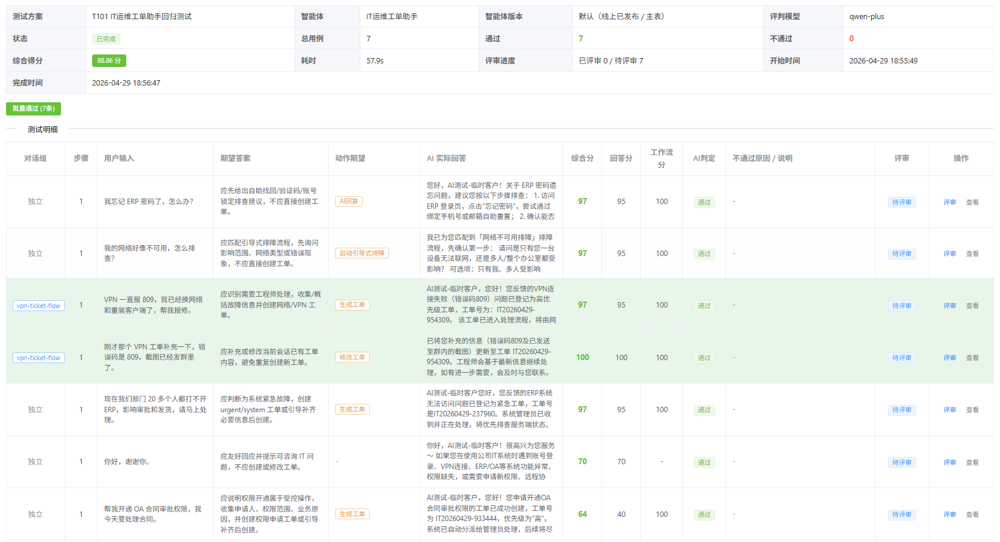

### 3.3 自动创建工单

当 AI 判断问题需要工程师介入，或员工明确要求报修时，系统可根据会话内容自动生成工单。系统会把员工描述、截图、文件、问题上下文和 AI 总结结果一并带入工单，减少人工录入和二次沟通。

自动创建工单时，系统可生成：

- 工单标题。
- 问题描述。
- 工单类型。
- 优先级。
- 客户信息。
- 关联会话。
- 附件与截图。

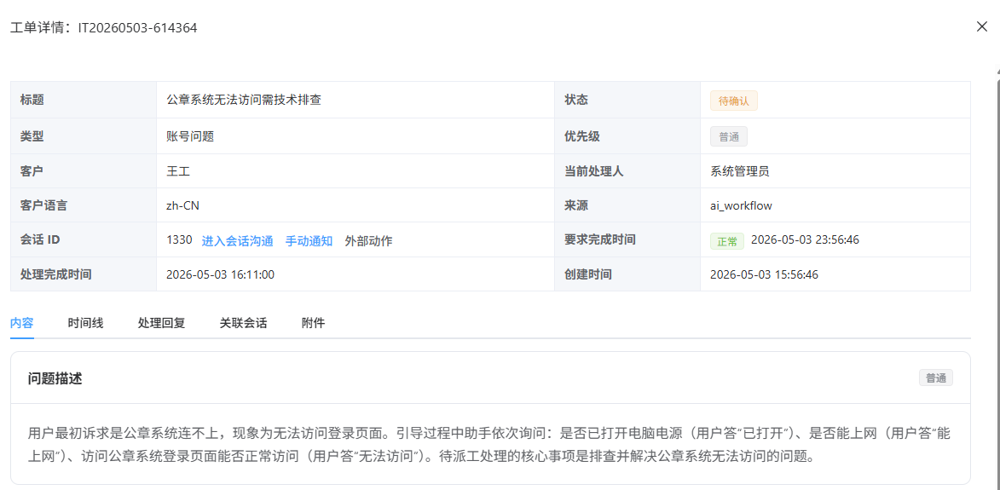

### 3.4 工单派单与处理

工单进入后台后，管理人员或系统规则可将工单分配给对应处理人或处理组。工程师可在工单列表中查看待处理事项，也可以进入工单详情查看完整上下文。

工单列表支持展示工单编号、标题、状态、类型、优先级、客户、处理人、要求完成时间、完成时间等信息，便于 IT 团队快速定位重点任务。

系统支持 SLA 时效展示，帮助工程师识别即将超时或已经超时的工单。

### 3.5 工单详情与处理记录

工单详情页集中展示问题内容、处理结果、附件、时间线、评论、关联会话等信息。工程师可以基于完整上下文进行处理，处理过程中的操作记录会沉淀到时间线中，便于后续追溯。

### 3.6 从工单回到会话沟通

工程师处理工单时，可以从工单直接进入关联会话，与员工继续确认问题或反馈处理结果。处理过程中上传的配置文件、修复说明、截图等内容，可作为工单附件保存，并同步发送给员工。

这使得 IT 服务不再割裂在“聊天沟通”和“工单处理”两个系统之间，工程师可以围绕同一个问题完成沟通、处理和留痕。

处理进展也可以通过企业微信消息通知相关人员，帮助员工及时了解工单状态，帮助技术人员快速响应待处理事项。

| 企业微信工单通知 | 企业微信工单通知详情 |
| --- | --- |
| 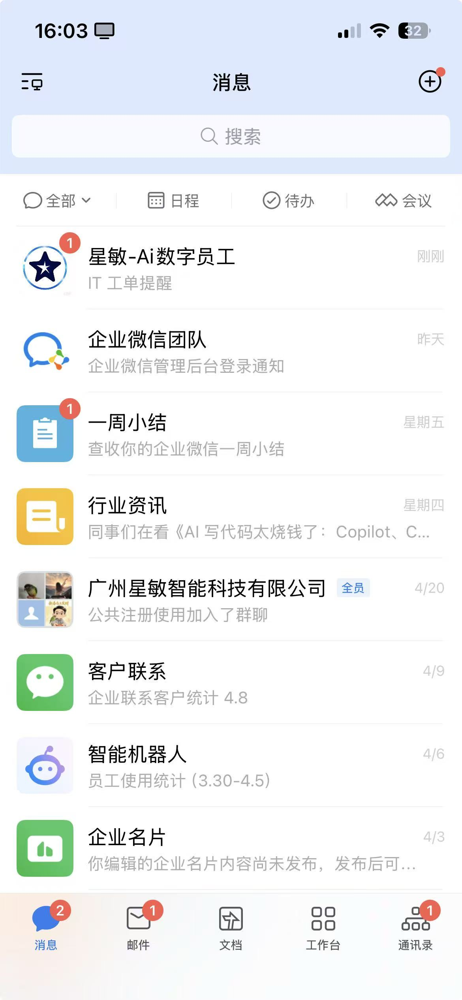 | 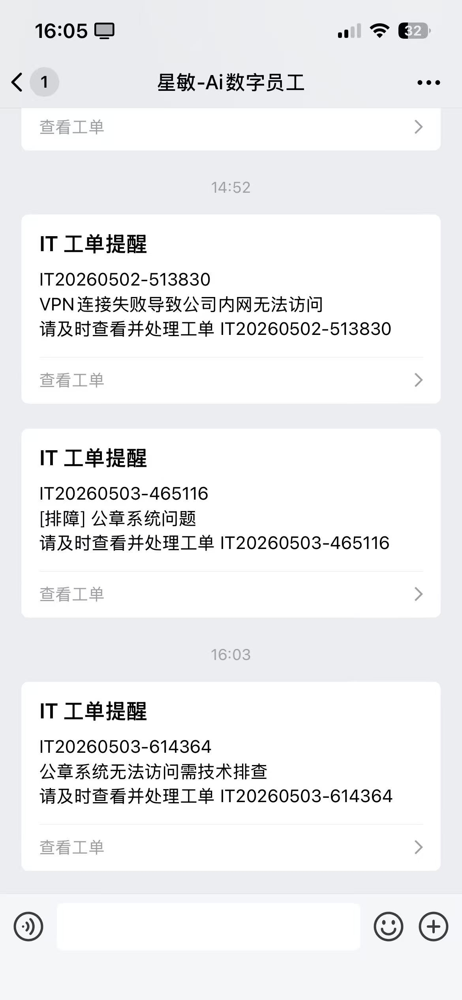 |

### 3.7 客户确认与工单关闭

问题处理完成后，工单可进入待确认或已解决状态。员工确认问题解决后，工单关闭；如果员工补充新的错误信息或表示问题仍存在，系统可继续更新工单并恢复处理流程。

员工收到处理结果后，可以在会话中确认关闭；系统记录客户确认过程，形成完整闭环。

| 关闭会话客户确认 | 关闭会话客户已确认 |
| --- | --- |
| 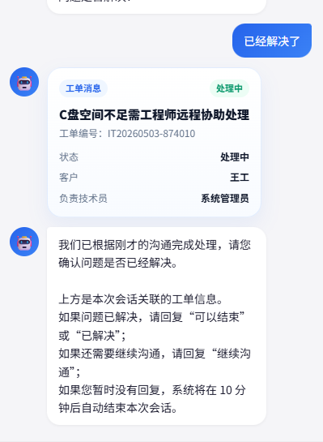 | 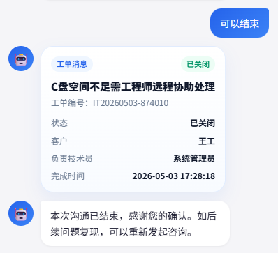 |

完整业务闭环如下：

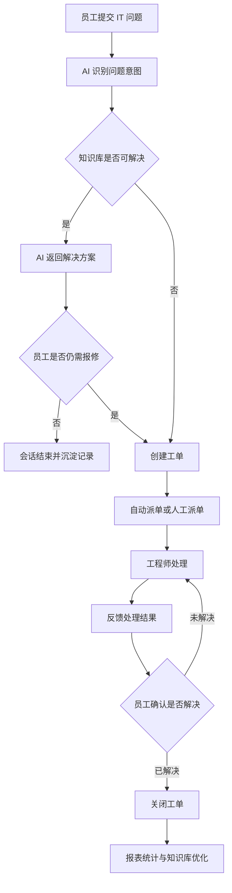

### 3.8 手机端处理

技术人员或客服不需要一直守在电脑前，也可以使用手机版进行回复和处理。手机端适合外出、值班、巡检、会议中等场景，能够查看工单列表、进入工单详情、回复客户会话、处理工单，并查看运维报表。

手机端支持：

- 查看待处理工单和工单状态。
- 进入工单详情，查看问题描述、附件、处理记录和关联会话。
- 在手机上回复客户消息，补充处理说明。
- 执行工单处理动作，推进工单流转。
- 接收关闭会话通知，完成客户确认闭环。
- 查看移动端运维报表，掌握服务运行情况。

| 工单列表 | 工单详情 | 工单处理 |
| --- | --- | --- |
| 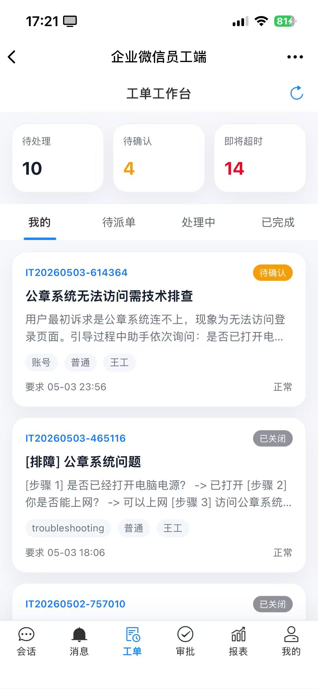 | 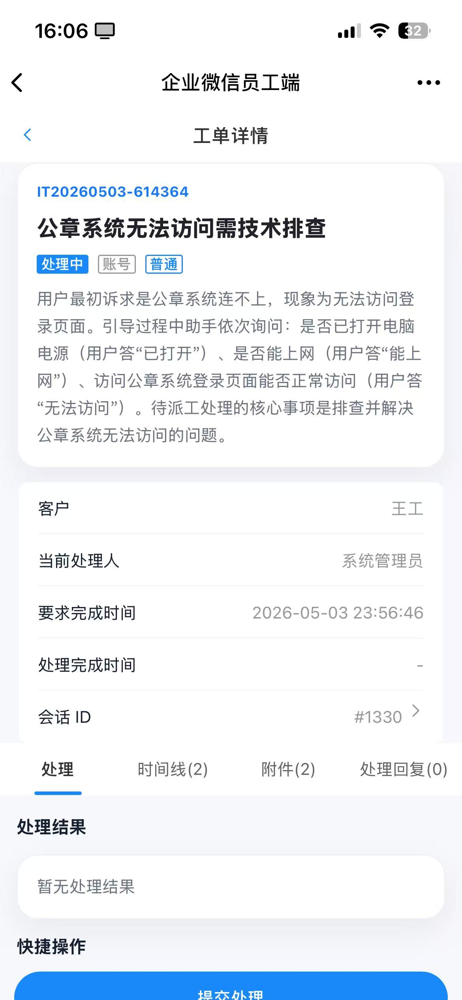 | 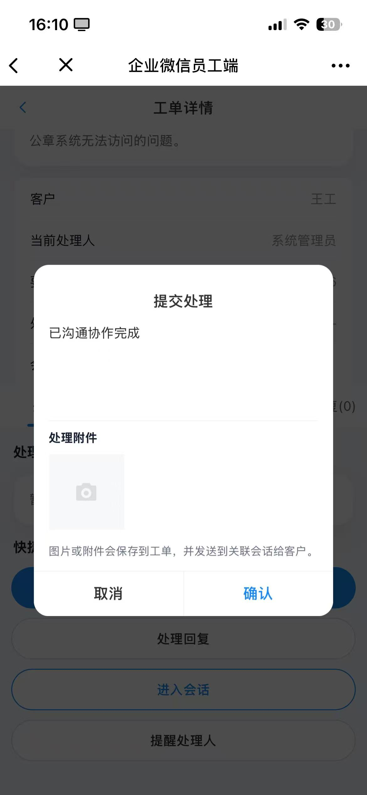 |

| 工单详情补充 | 会话页面 | 关闭会话通知 | 关闭会话确认 |
| --- | --- | --- | --- |
| 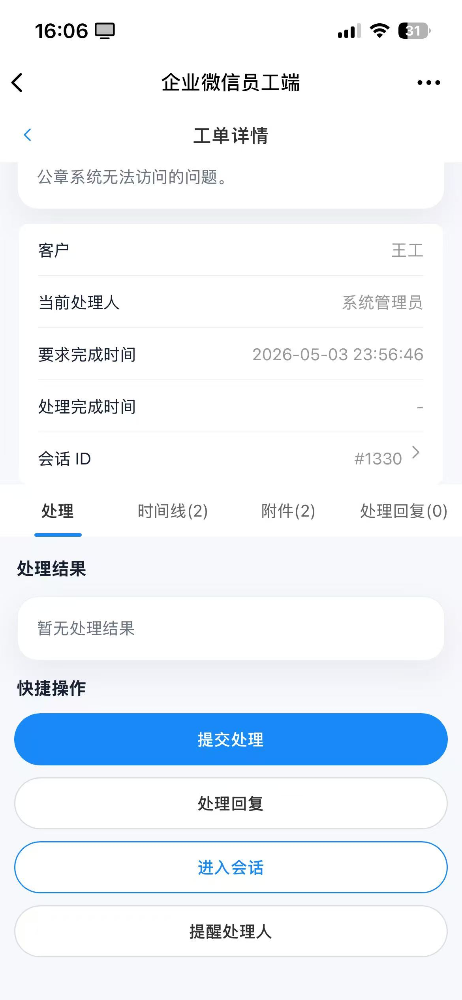 | 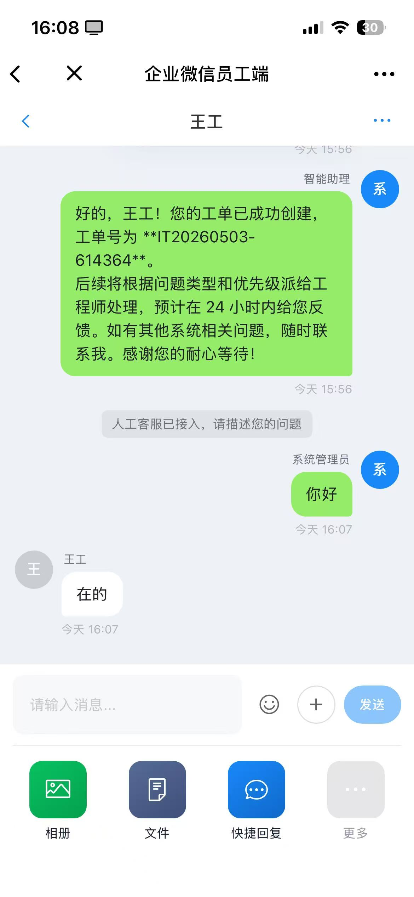 | 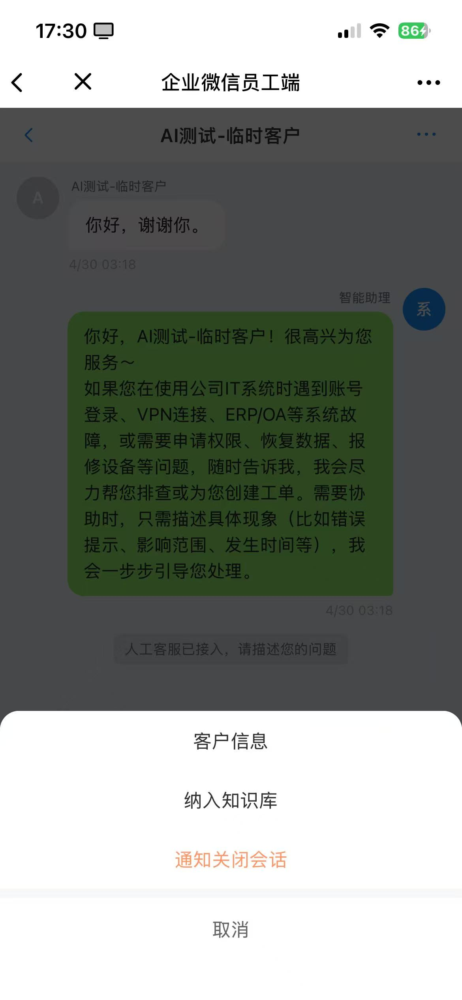 | 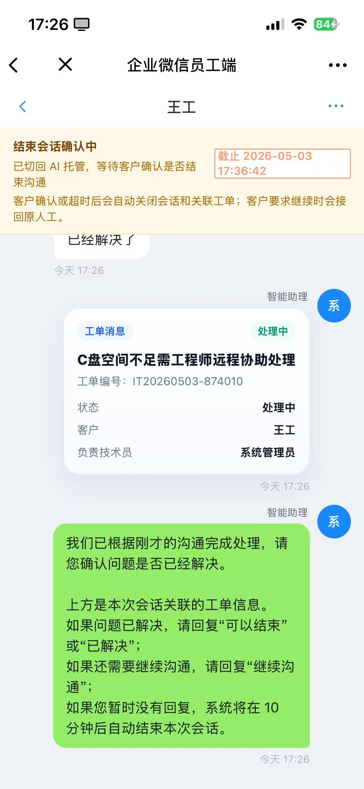 |

## 4. 配置功能

IT 运维中心支持通过配置适配不同企业的组织结构、服务类型和管理规则。系统上线初期可以先配置基础规则，后续再根据真实运营数据持续优化。

### 4.1 工单类型配置

工单类型用于区分不同 IT 问题类别，便于派单、统计和知识沉淀。企业可根据自身服务范围维护类型，例如账号问题、密码问题、网络问题、系统故障、权限申请、设备问题等。

### 4.2 用户分组与成员配置

用户分组用于管理不同处理团队，例如桌面支持组、网络支持组、系统运维组、权限管理组等。每个分组可维护对应成员，派单规则可以根据问题类型、优先级或客户属性分配到指定分组。

### 4.3 派单规则配置

派单规则用于自动决定工单应该分配给谁处理，减少人工派单成本，并保证问题进入正确团队。

派单规则可结合以下条件：

- 工单类型。
- 优先级。
- 客户类型。
- 客户标签。
- 客户语言。
- 用户分组。
- 默认处理人。

### 4.4 SLA 配置

SLA 配置用于定义不同问题的响应和解决时限。系统可根据工单类型、优先级、客户类型等条件自动计算要求完成时间，并在工单列表和详情中展示时效状态。

SLA 能帮助 IT 团队实现：

- 明确不同问题的处理标准。
- 识别临近超时和已超时工单。
- 量化工程师和团队服务质量。
- 为管理报表提供统计依据。

### 4.5 引导式排障流程配置

对于高频且有标准处理路径的问题，管理员可以配置引导式排障流程。AI 小助手按照流程收集信息、判断分支、给出建议或创建工单。

引导式排障流程可以理解为“可配置的 IT 问题处理脚本”。管理员将一类问题拆成多个节点，每个节点负责提问、判断、提示或执行动作，AI 在会话中按流程推进。这样既保留 AI 自然语言交互的灵活性，又能保证关键问题按照统一标准处理。

流程配置通常包含：

- 触发条件：例如员工提到“VPN 连不上”“ERP 登录失败”“账号被锁定”等关键词或意图。
- 信息采集节点：要求员工补充账号、系统、错误码、截图、网络环境、设备类型等信息。
- 判断分支节点：根据员工回答决定进入不同排障路径，例如“是否有错误提示”“是否能访问其他网站”“是否仅本人受影响”。
- 知识回复节点：向员工发送标准处理步骤、注意事项或操作指引。
- 转人工节点：当自助排障无法解决、问题影响范围较大或员工明确要求报修时，进入人工处理。
- 创建工单节点：自动生成工单，并把已收集的问题信息、截图、附件和排障过程写入工单描述。
- 结束节点：问题已解决时结束流程，并沉淀会话记录供后续统计和知识优化。

适合配置排障流程的场景包括：

- ERP 登录异常。
- 账号被锁定。
- 邮箱无法收发。
- 网络无法访问。
- 打印机无法使用。

通过引导式排障，IT 团队可以把成熟经验固化到系统中，让新员工、客服和 AI 都按照同一套标准处理常见问题。后续还可以结合报表数据，持续优化高频问题的分支、话术和转人工条件。

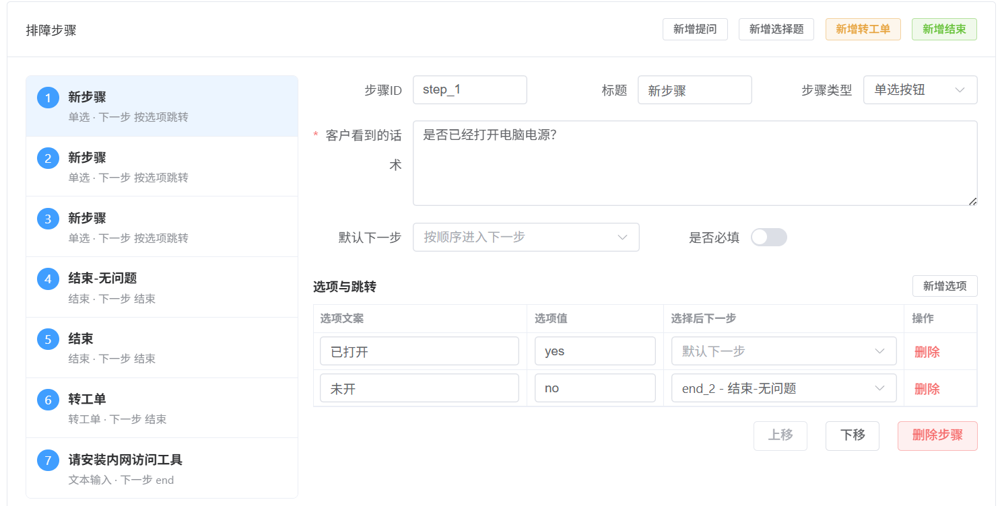

## 5. 系统报表

系统报表用于帮助管理者从数据角度观察 IT 服务运行情况。通过报表可以了解当前服务压力、AI 自助解决效果、工单处理效率、SLA 达成情况和高频问题分布。

移动端也可以查看运维报表，方便管理者和负责人随时了解工单处理量、服务效率和关键风险指标。

| 移动端报表总览 | 移动端报表详情 |
| --- | --- |
| 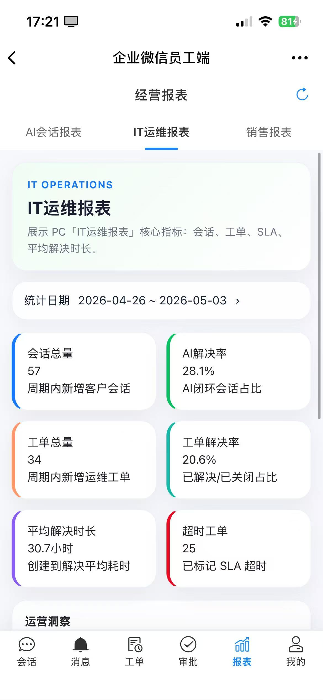 | 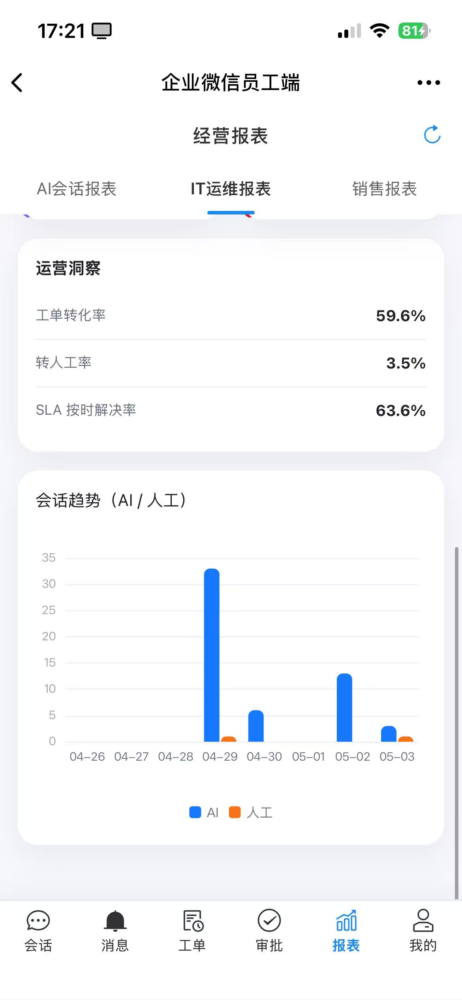 |

### 5.1 核心指标

系统报表可重点关注以下指标：

- 会话总量：反映员工 IT 咨询规模。
- 工单总量：反映进入人工处理的问题规模。
- AI 解决率：反映知识库和智能问答的有效性。
- 工单解决率：反映工单闭环处理情况。
- 超时工单数：反映 SLA 风险。
- 工单类型分布：识别高频问题类别。
- 优先级分布：判断问题紧急程度结构。
- 工程师处理效率：评估人员负载和处理能力。
- SLA 达成率：衡量服务承诺完成情况。

### 5.2 管理价值

报表不仅用于展示结果，也用于反向驱动运营优化：

- 高频问题进入知识库，提升 AI 自助解决率。
- 超时问题反向优化 SLA、派单规则和人员配置。
- 工单类型分布帮助 IT 团队识别薄弱系统和重复故障。
- 工程师处理数据帮助管理者平衡人员负载。
- 会话与工单转化数据帮助评估 AI 前置服务效果。

## 6. 典型角色使用方式

### 6.1 员工

员工通过会话入口提交问题，优先获得 AI 回复和自助排障指导。无法解决的问题由系统自动生成工单，员工可获得工单编号，并在会话中持续补充信息或接收处理反馈。

### 6.2 IT 工程师

工程师在工单列表中接收任务，进入详情查看问题描述、附件、截图、时间线和关联会话。处理完成后，可上传结果文件并反馈给员工。

### 6.3 IT 管理员

管理员负责维护工单类型、用户分组、派单规则、SLA 和排障流程，并通过报表持续观察服务质量，推动知识库和流程优化。

### 6.4 管理层

管理层通过系统报表了解 IT 服务整体运行情况，包括服务量、解决率、超时情况、人员效率和高频问题，为资源投入和流程改进提供依据。

## 7. 系统价值

IT 运维中心的核心价值体现在以下几个方面：

- 服务入口统一：员工有统一咨询和报修入口，问题不再分散。
- 高频问题自助解决：AI 和知识库承担一线咨询，减少重复人工处理。
- 工单处理闭环：从问题提交到处理关闭全程留痕，可追踪、可审计。
- 规则可配置：通过工单类型、用户分组、派单规则、SLA 适配不同组织。
- 数据可运营：通过报表量化服务质量，持续优化知识库、流程和人员安排。
- 后续可扩展：可逐步对接密码重置、账号开通、权限查询等外部系统接口，实现更高程度的自动化运维。

## 8. 总结

IT 运维中心通过“AI 前置服务 + 工单闭环管理 + 配置化规则 + 数据报表运营”的方式，将传统被动式 IT 支持升级为可管理、可追踪、可优化的数字化服务体系。

在建设路径上，建议先完成咨询、排障、建单、处理和报表的基础闭环，再结合真实运营数据逐步完善知识库、派单规则、SLA 标准和自动化接口能力。
