# IT 运维小助手需求应对方案 (PPT 大纲 - NotebookLM 专用)

> **文档说明：** 本文档专为 NotebookLM 生成 PPT 或播客讲解设计。采用“幻灯片标题 + 核心要点 + 演讲备注”的结构，确保 AI 能充分理解我们系统“完全有能力承接客户 IT 运维业务需求”的核心逻辑。

---

## Slide 1: 封面
**标题：IT 运维小助手 —— 智能化 IT 服务解决方案**
**副标题：打造可跟踪、可闭环、可统计的新一代 IT 运维体系**

**演讲备注（Speaker Notes）：**
各位客户好，今天为您汇报“IT 运维小助手”的需求应对方案。我们深知贵司当前在 IT 运维服务中面临咨询量大、人工重复解答、进度难追踪等痛点。本方案旨在向您展示，我们如何利用成熟的现有平台，为您快速搭建一套具备多语言沟通、AI 前置排障、工单全生命周期管理的闭环系统。

---

## Slide 2: 业务痛点与建设目标
**核心要点：**
- **统一入口**：建立支持自然语言提问与多媒体附件的 IT 咨询总入口。
- **AI 拦截**：通过 AI 智能体与引导式排障，优先拦截高频常见问题。
- **闭环管理**：咨询无缝转工单，实现派单、处理、客户确认的完整闭环。
- **效能度量**：建立可视化的 SLA 时效与报表体系，量化 IT 团队产出。
- **面向未来**：预留外部系统 API 接口，逐步迈向自动化运维。

**演讲备注（Speaker Notes）：**
这页明确了我们的建设目标。我们要做的不仅是一个聊天机器人，而是一个能将“咨询”升级为“标准服务”的系统。核心是降低人工介入率，并让每一个流转到人工的请求都有迹可循、有始有终，并且后续可以通过自动化 API 让系统自己去重置密码或开通权限。

---

## Slide 3: 方案全景：基于成熟平台的高效扩展
**核心要点：**
- **拒绝从零开发**：基于已验证的“星敏数字员工平台”进行行业化扩展。
- **能力全面复用**：已具备 IM 会话、AI 智能体、知识库、工单管理与报表引擎。
- **交付周期短**：核心底座已就绪，当前版本已能演示绝大多数核心流程。
- **风险可控**：成熟系统的稳定性与扩展性，确保项目顺利落地。

> 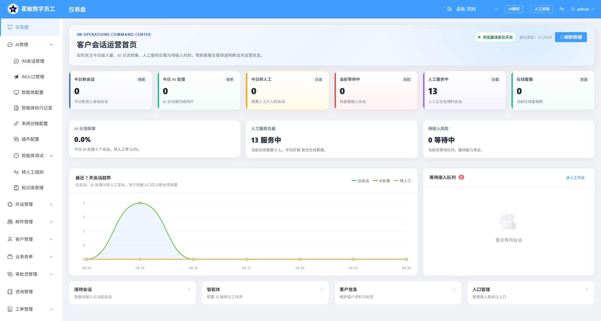

**演讲备注（Speaker Notes）：**
为什么我们能迅速承接贵司的需求？因为我们不是从 0 到 1 写代码，而是站在“星敏平台”的肩膀上。这意味我们交付快、系统稳。目前，我们在演示版本中已经跑通了从 AI 对话到工单流转的全流程，随时可以为您提供直观的操作体验。

---

## Slide 4: 核心能力一：AI 智能问答与自助排障
**核心要点：**
- **智能意图识别**：精准区分“常见咨询”与“需要报修”的场景。
- **引导式排障引擎**：可视化编排排障节点（如基础检查、影响范围、生成工单等），通过单选、多选等组件分步引导客户排查。
- **动态分支跳转**：依据客户的选择自动进入下一步处理逻辑或直接转人工/工单。
- **多模态交互**：支持文本、图片、文件发送，保留完整的报错截图。

> 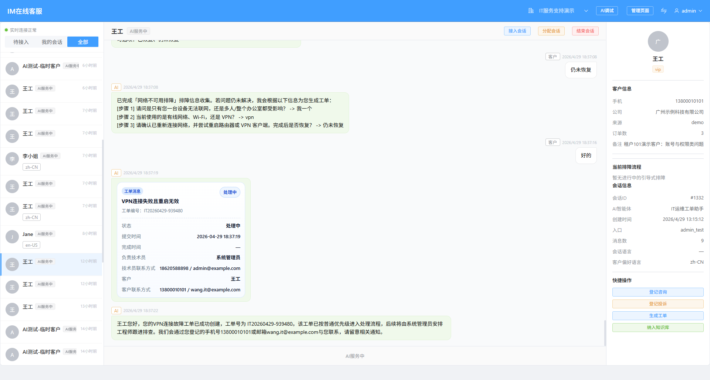
> 

**演讲备注（Speaker Notes）：**
当客户遇到问题（比如网络不可用），AI 首先充当一线客服，提供排障建议。这套“引导式排障系统”是我们的一大特色。运维人员可以通过非常直观的界面配置排障步骤。比如系统会先问“是只有您连不上还是整个办公室都受影响？”，客户只需点击按钮选择，系统会根据答案自动决定是继续排查，还是立刻转派工单。这种可视化的分步引导能解决掉绝大部分简单问题，极大地减轻 IT 工程师的日常压力。

---

## Slide 5: 核心能力二：AI 驱动的智能工单流转
**核心要点：**
- **AI 自动建单**：排障失败或客户明确要求时，AI 自动总结上下文并生成工单号。
- **上下文继承**：会话记录、错误码、截图自动带入工单，避免客户重复描述。
- **智能更新与关闭**：客户补充信息自动追加到原有工单；问题解决可自动关闭工单。
- **AI 能力自动化评测**：内置自动化跑分平台，量化验证 AI 在各种运维场景下意图识别、动作执行的准确率，保障上线效果。

> 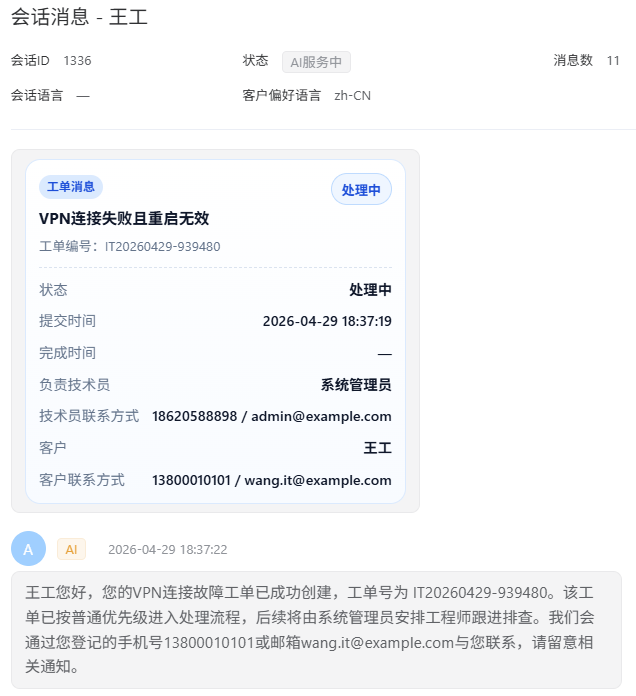
> 

**演讲备注（Speaker Notes）：**
这是我们区别于传统系统的亮点：AI 与工单是无缝融合的。客户如果说“帮我报修”，AI 会自动提炼他的问题和截图生成工单，不用客户去填繁琐的表单。如果客户补充了一句“报错代码是 809”，AI 会自动更新到已有工单，不会生成重复的垃圾工单。更重要的是，我们提供了一套“AI 能力测评平台”。系统上线前，可以通过批量跑分测试，客观量化 AI 对各种复杂意图的理解准确率，比如能否精准区分“建单”、“改单”还是“只是寒暄”，确保 AI 的表现稳定可靠。

---

## Slide 6: 核心能力三：专业级工单管理与 SLA
**核心要点：**
- **精细化管理**：支持工单状态流转（待处理、处理中、已解决、已挂起等）。
- **灵活派单规则**：按工单类型、优先级、客户语言自动路由给对应技术组。
- **SLA 时效管控**：系统自动计算要求完成时间，提供超时预警与标记。

> 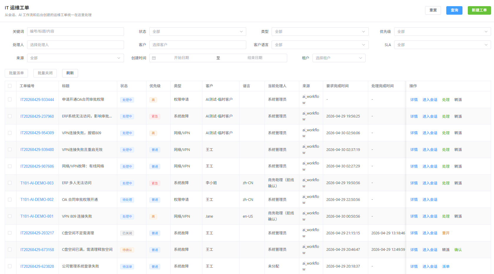
> 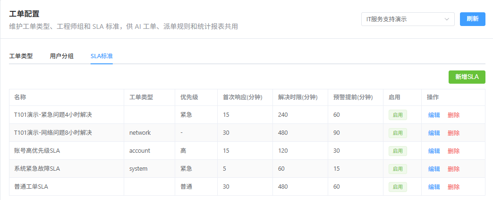
> 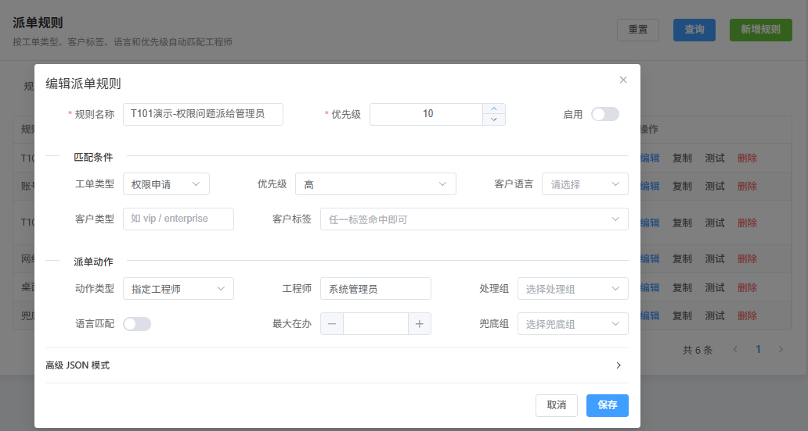

**演讲备注（Speaker Notes）：**
工单生成后，就进入了严谨的管理流程。我们的派单引擎可以根据贵司的组织架构（比如网络组、桌面组）自动分发工单。SLA 管理确保了每个工单都有明确的时间线要求，保障了 IT 服务的时效性和服务质量。

---

## Slide 7: 核心能力四：技术侧的高效工作台
**核心要点：**
- **工单-会话一键穿透**：工程师可从工单直接跳转到关联的客户聊天界面。
- **附件双向互通**：处理工单时上传的修复说明或文件，自动推送到客户微信/IM。
- **企微协同（预留）**：支持企业微信工单提醒、转派提醒与移动端轻量处理。

> 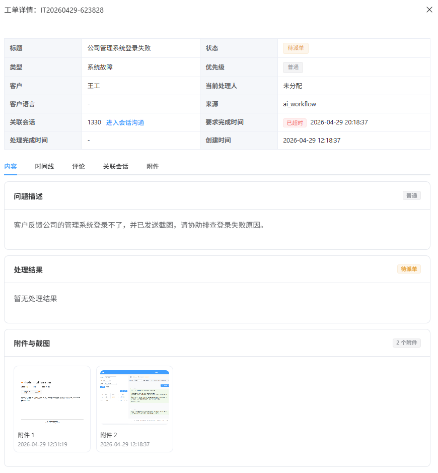
> 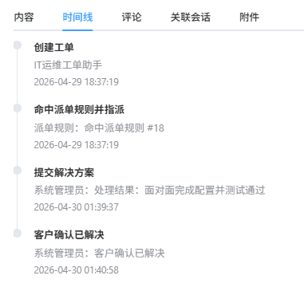
> 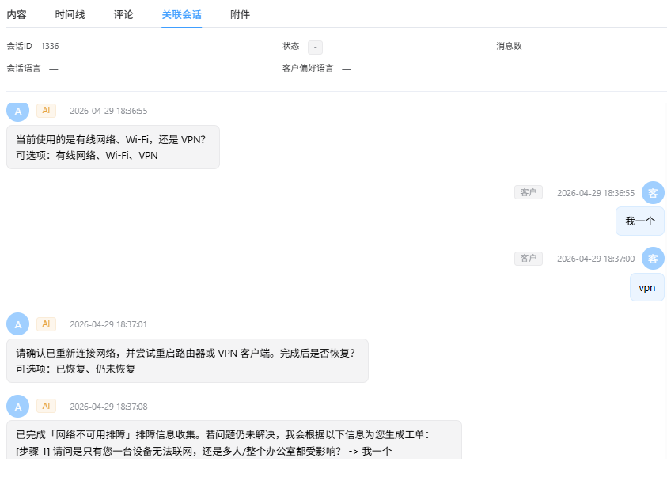
> 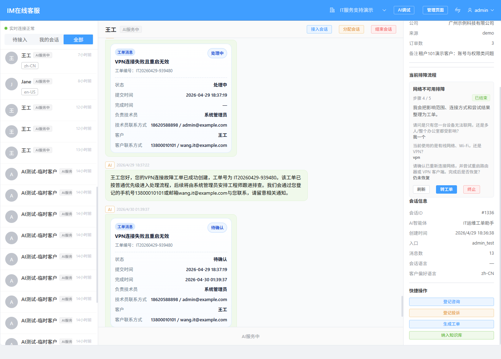

**演讲备注（Speaker Notes）：**
对于 IT 工程师来说，系统好用是第一位的。我们彻底打通了“工单”和“会话”。工程师看工单时，点一下就能看到客户的原始聊天记录，甚至能直接在里面继续和客户沟通。工程师上传的解决说明，也能直接发到客户的对话框里，沟通效率极高。

---

## Slide 8: 核心能力五：数据驱动的运营报表
**核心要点：**
- **全景数据看板**：聚合展示会话量、工单量、AI 解决率等核心指标。
- **效能洞察**：分析各类型工单分布、平均响应时间与各工程师处理效率。
- **服务质量监控**：追踪超时工单与一次解决率，辅助管理决策。

> 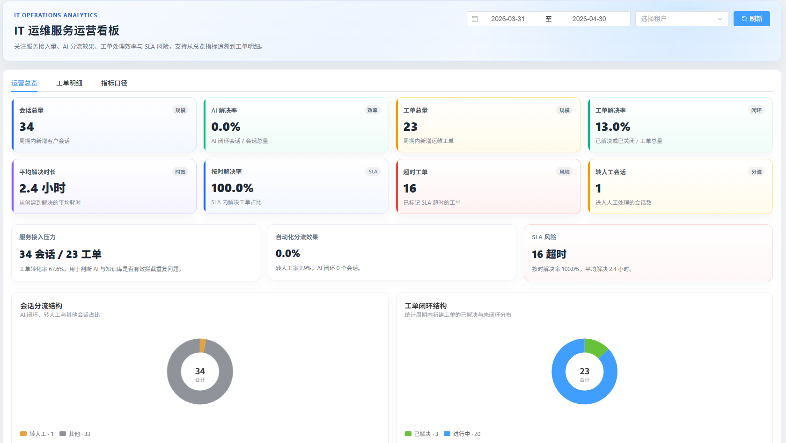
> 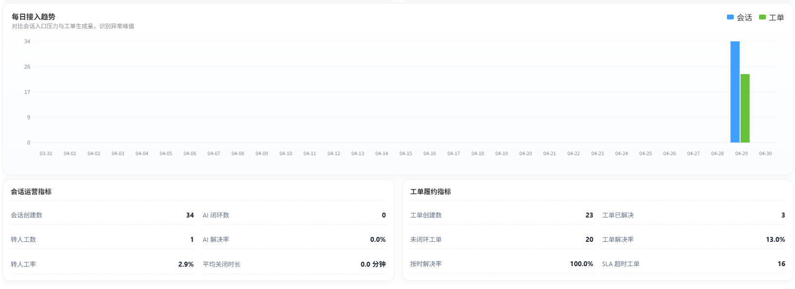

**演讲备注（Speaker Notes）：**
系统不仅能做事，还能算账。我们的报表看板把原本黑盒的 IT 运维透明化了。管理层可以清晰看到 AI 拦截了多少问题，哪个工程师处理得最快，哪类问题频发需要底层优化，让 IT 团队的价值可量化。

---

## Slide 9: 为什么选择我们？（核心竞争优势）
**核心要点：**
- **真闭环**：不仅是聊天机器人，更是“对话+工单+协同”的完整闭环。
- **防扯皮**：全程留痕，日志清晰，客户与工程师沟通内容完全沉淀。
- **高适配**：配置化的派单、用户组与 SLA，随企业组织变化灵活调整。
- **易扩展**：先闭环提效，后续无缝接入 API 实现重置密码等全自动化操作。

> 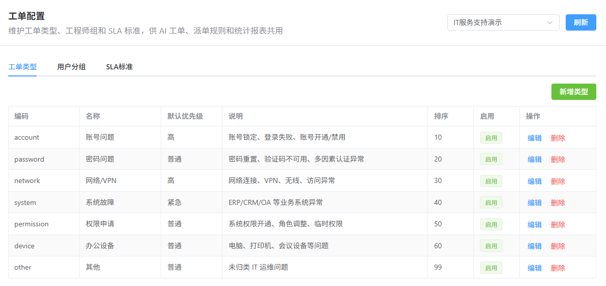
> 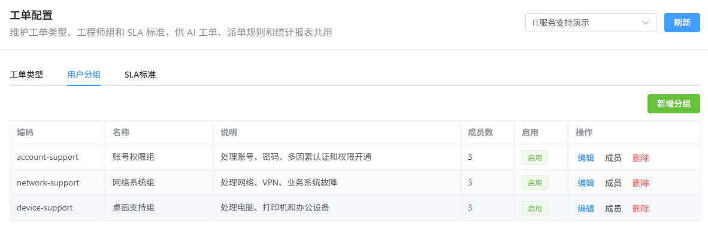

**演讲备注（Speaker Notes）：**
总结一下，选择我们的系统，您得到的是一套立刻能用、交付快、真正懂 IT 运维闭环的成熟产品。我们能帮您留存所有沟通记录防扯皮，并且系统具备极强的生命力，今天做辅助，明天可以对接贵司的业务系统，实现自动化运维。

---

## Slide 10: 实施路径与交付计划
**核心要点：**
- **第一阶段：演示验证与基础闭环**（即刻启动，跑通 AI 到工单的完整链路）。
- **第二阶段：试点上线与规则完善**（配置贵司真实的 SLA、派单组，接入真实数据）。
- **第三阶段：自动化运维扩展**（对接密码重置、权限审批等第三方系统 API）。

> 

**演讲备注（Speaker Notes）：**
为了保证项目稳妥落地，我们建议分三步走。第一阶段我们先跑通核心闭环，让大家看到效果；第二阶段引入您真实的业务规则进行试点；第三阶段再去啃硬骨头，对接各个业务系统做自动化。这样风险最小，见效最快。

---

## Slide 11: 预期收益与管理价值 (ROI)
**核心要点：**
- **成本降低**：AI 与知识库拦截，预计减少 30%-50% 人工咨询量。
- **效率提升**：智能派单与会话上下文带入，响应效率预计提升 30% 以上。
- **管理升级**：服务过程可量化，经验可沉淀，敏感操作可审计。

**演讲备注（Speaker Notes）：**
最后看看收益。系统上线后，预计能为贵司拦下 30% 到 50% 的常见问题；因为有了上下文传递和高效工作台，工程师的处理效率能提升至少三成。更重要的是，整个 IT 团队的服务能力从“凭感觉”变成了“有数据支撑”的精细化运营。

---

## Slide 12: 结语
**核心要点：**
- **系统已就绪，随时可进行全流程演示。**
- **期待与您共建智能化的 IT 服务中心。**

**演讲备注（Speaker Notes）：**
感谢您的聆听。目前这套系统的核心功能已经就绪，我们随时可以为您进行真实环境的操作演示。期待能与贵司携手，打造新一代的智能化 IT 服务中心。
