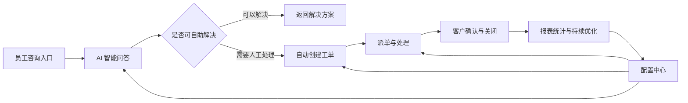
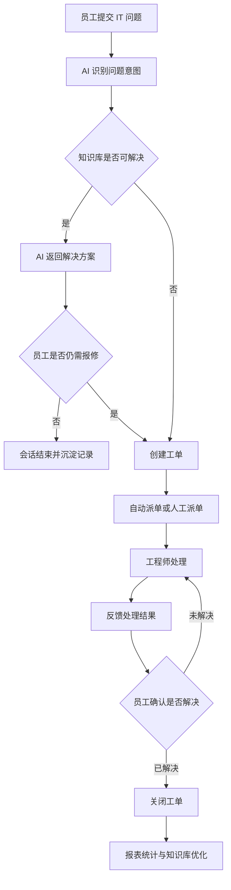

# 星敏数字员工-IT 运维中心系统介绍 (PPT 大纲 - NotebookLM 专用)

> **文档说明：** 本文档专为 NotebookLM 生成 PPT 或播客讲解设计。在完全保留原版《02-IT运维中心系统介绍.md》详细内容与所有截图的基础上，进行了适合 AI 解析的“Slide 幻灯片”结构排版，并增加了口语化的“演讲备注（Speaker Notes）”。

---

## Slide 1: 封面与系统概述
**标题：星敏数字员工-IT 运维中心**
**副标题：一体化的企业 IT 数字化运营平台**

**详细内容：**
IT 运维中心基于星敏数字员工平台建设，面向企业内部 IT 服务场景，提供“智能咨询、引导排障、工单处理、配置管理、数据报表”的一体化能力。系统将员工日常 IT 咨询入口、AI 自助服务、人工工单处理和管理报表整合到同一平台中，帮助 IT 团队提升响应效率、规范服务流程，并沉淀可持续优化的数据资产。

> 

**演讲备注（Speaker Notes）：**
各位好，今天为大家介绍“星敏数字员工-IT 运维中心”。它不是一个简单的聊天机器人，而是一个真正把咨询、排障、工单流转和数据报表全部打通的一体化平台。我们的目标是把 IT 团队从繁杂的日常琐事中解放出来，让每一次服务都变得高效且有迹可循。

---

## Slide 2: 系统定位与解决痛点
**标题：系统定位**
**副标题：覆盖 IT 服务全流程的数字化运营平台**

**详细内容：**
IT 运维中心不是单一的问答机器人，也不是孤立的工单系统，而是一套覆盖 IT 服务全流程的数字化运营平台。
系统主要解决以下问题：
- 员工 IT 问题入口分散，咨询记录难以统一沉淀。
- 高频问题重复咨询，占用 IT 工程师大量时间。
- 报修问题描述不完整，工程师需要反复追问。
- 工单派发、处理、反馈和关闭过程不够透明。
- IT 服务质量缺少统一指标，管理者难以评估服务效率。

通过 IT 运维中心，企业可以建立统一的 IT 服务入口，将咨询、排障、建单、派单、处理、确认、关闭、统计分析形成完整闭环。

**演讲备注（Speaker Notes）：**
我们做这套系统，就是为了解决 IT 部门最头疼的几个问题：问题到处都是（微信、电话、邮件）、简单问题天天被问、客户报修时“只说坏了不说报错代码”。有了这个中心，一切都在闭环内运转，从源头收集完整信息，到最终的数据呈现，彻底告别过去那种“黑盒式”的运维支持。

---

## Slide 3: 系统功能总览与架构
**标题：系统功能总览**
**副标题：四大模块支撑业务闭环**

**详细内容：**
系统功能可分为三大部分：
1. 业务流程：覆盖客户咨询、AI 排障、工单创建、派单处理、客户确认和服务闭环。
2. 配置功能：支持工单类型、用户分组、派单规则、SLA、排障流程等基础规则配置。
3. 系统报表：统计会话、工单、AI 解决率、SLA、工程师效率等关键运营指标。
4. 多端接入：支持通过 JSSDK、系统链接、企业微信和移动端接入，嵌入到企业已有业务系统中。

**业务流转图：**

**演讲备注（Speaker Notes）：**
这是我们系统的全景架构图。大家可以看到，四大模块环环相扣。员工提问后，AI 先拦截；拦不住的，自动走工单派给人工；人工处理完，数据进入报表；最后管理层根据报表来调整底层的配置规则。这是一个能自我进化的闭环系统。

---

## Slide 4: 多端接入能力
**标题：多端接入，无处不在**
**副标题：无缝嵌入企业现有业务场景**

**详细内容：**
IT 运维中心可以作为独立入口使用，也可以嵌入到企业现有系统中，减少员工切换系统的成本。
可接入方式包括：
- JSSDK 接入：在 ERP、OA、门户、业务中台等 Web 系统中嵌入咨询入口，员工无需离开当前业务页面即可发起 IT 咨询。
- 页面链接接入：通过菜单、按钮、帮助中心、系统公告等方式跳转到 IT 运维小助手。
- 企业微信接入：通过企业微信消息、应用入口或通知卡片触达员工和处理人员。
- 移动端接入：技术人员或客服可在手机端查看工单、回复会话、处理问题和查看运维报表。
- API 扩展接入：后续可对接密码重置、账号开通、权限查询等外部系统接口，实现自动化处理。

第三方系统可以在业务页面中直接发起咨询，适合嵌入 ERP、OA、门户系统、内部工具平台等场景。

| 第三方系统发起咨询入口-引导式排障流程 | 第三方系统发起咨询入口-生成工单 |
| --- | --- |
|  |  |

**演讲备注（Speaker Notes）：**
为了让员工用得爽，我们提供了极强的接入能力。比如员工正在用 OA，突然卡住了，不需要切出去找 IT，直接在 OA 页面点个悬浮窗就能呼出我们的助手。当然，企业微信、移动端更是全面支持，随时随地提供服务。

---

## Slide 5: 业务流程一：统一咨询入口
**标题：统一咨询入口**
**副标题：多模态交互，覆盖高频场景**

**详细内容：**
员工可以通过会话入口提交 IT 咨询或故障报修，支持文字、图片、截图、文件等多种消息形式。AI 小助手作为一线服务入口，优先识别员工问题类型，并结合知识库或排障流程给出处理建议。

典型咨询包括：
- 账号、密码、验证码、账号锁定等登录问题。
- VPN、网络、打印机、办公设备等环境问题。
- ERP、OA、企业微信、邮箱等业务系统使用问题。
- 权限申请、系统开通、数据访问等流程类问题。

> 

**演讲备注（Speaker Notes）：**
在咨询入口，我们支持文字、图片、文件等多种方式。无论是密码忘了，还是网络不通，员工只需随手拍个报错截图发过来，AI 就会像一位经验丰富的一线客服一样，立刻开始识别并处理。

---

## Slide 6: 业务流程二：AI 智能问答与引导排障
**标题：AI 智能问答与引导排障**
**副标题：分步引导，提前补齐问题上下文**

**详细内容：**
对于常见问题，AI 小助手可直接根据知识库回答；对于需要进一步确认的信息，系统可通过引导式排障流程逐步收集关键字段，例如系统名称、错误提示、截图、影响范围、发生时间等。

引导式排障适合处理“员工不知道该怎么描述问题、工程师需要反复追问”的场景。系统会把传统人工追问过程整理成标准步骤，由 AI 在会话中自动引导员工逐项确认，既能提升员工自助解决体验，也能让后续工单信息更完整。

引导式排障通常包括以下过程：
- 识别问题类型：先判断员工咨询的是账号、网络、系统登录、权限、设备还是其他问题。
- 收集必要信息：根据问题类型要求员工补充系统名称、账号、错误提示、截图、发生时间、影响范围等信息。
- 给出排障建议：结合知识库或预设流程，返回重试、检查、清理缓存、切换网络、确认权限等处理步骤。
- 判断是否解决：员工反馈已解决时结束会话；仍未解决时继续排障或创建工单。
- 自动带入工单：如果需要人工处理，系统将前面收集的信息、截图和排障记录一起带入工单。

这一阶段的目标是让简单问题在会话中直接解决，让复杂问题在进入工单前尽可能补齐上下文，减少工程师接单后的重复沟通。

> 

系统也可以对 AI 的自动化能力进行测评，验证智能体在识别问题、创建工单、更新工单、关闭工单等关键动作上的执行效果，便于上线前检查和上线后持续优化。

> 

**演讲备注（Speaker Notes）：**
这是我们的杀手锏：引导式排障。很多时候员工只会说“网断了”，通过我们可视化的排障流程配置，AI 会自动一步步追问“是只有你断了，还是大家都没网？”。不仅能帮员工自助解决问题，就算要转人工，工程师拿到的工单也是信息完备的。同时，我们还内置了 AI 跑分工具，确保 AI 的意图理解足够精准。

---

## Slide 7: 业务流程三：自动创建工单
**标题：自动创建工单**
**副标题：AI 提炼信息，告别手动填表**

**详细内容：**
当 AI 判断问题需要工程师介入，或员工明确要求报修时，系统可根据会话内容自动生成工单。系统会把员工描述、截图、文件、问题上下文和 AI 总结结果一并带入工单，减少人工录入和二次沟通。

自动创建工单时，系统可生成：
- 工单标题。
- 问题描述。
- 工单类型。
- 优先级。
- 客户信息。
- 关联会话。
- 附件与截图。

> 

**演讲备注（Speaker Notes）：**
排障失败怎么办？AI 会立刻兜底。它会把刚才聊天的重点、报错代码、截图自动打包成一张标准的工单。员工不用填繁琐的报修单，工程师也不用再问一遍“您遇到什么问题了”。

---

## Slide 8: 业务流程四：工单派单与处理
**标题：工单派单与处理**
**副标题：规则路由与 SLA 时效管控**

**详细内容：**
工单进入后台后，管理人员或系统规则可将工单分配给对应处理人或处理组。工程师可在工单列表中查看待处理事项，也可以进入工单详情查看完整上下文。

工单列表支持展示工单编号、标题、状态、类型、优先级、客户、处理人、要求完成时间、完成时间等信息，便于 IT 团队快速定位重点任务。

> 

系统支持 SLA 时效展示，帮助工程师识别即将超时或已经超时的工单。

> 

**演讲备注（Speaker Notes）：**
工单生成后，会自动流转到工程师的待办列表里。我们支持强大的自动派单规则，网络问题找网络组，ERP 问题找业务组。更重要的是，引入了严格的 SLA 时效管理，超时会有颜色预警，确保每一个问题都有人在规定时间内处理。

---

## Slide 9: 业务流程五：工单详情与处理记录
**标题：工单详情与处理记录**
**副标题：多维信息聚合，操作全程留痕**

**详细内容：**
工单详情页集中展示问题内容、处理结果、附件、时间线、评论、关联会话等信息。工程师可以基于完整上下文进行处理，处理过程中的操作记录会沉淀到时间线中，便于后续追溯。

> 
> 
> 

**演讲备注（Speaker Notes）：**
工程师打开工单详情，看到的是一个聚合了所有上下文的工作台。包括内容、处理时间线，甚至能直接翻看员工最初跟 AI 沟通的聊天记录。这种全景视角的呈现，极大地提高了工程师的处理效率。

---

## Slide 10: 业务流程六：从工单回到会话沟通
**标题：从工单回到会话沟通**
**副标题：打通工单与聊天的壁垒**

**详细内容：**
工程师处理工单时，可以从工单直接进入关联会话，与员工继续确认问题或反馈处理结果。处理过程中上传的配置文件、修复说明、截图等内容，可作为工单附件保存，并同步发送给员工。
这使得 IT 服务不再割裂在“聊天沟通”和“工单处理”两个系统之间，工程师可以围绕同一个问题完成沟通、处理和留痕。

> 

处理进展也可以通过企业微信消息通知相关人员，帮助员工及时了解工单状态，帮助技术人员快速响应待处理事项。

| 企业微信工单通知 | 企业微信工单通知详情 |
| --- | --- |
|  |  |

**演讲备注（Speaker Notes）：**
以前，工程师看工单有疑问，还要切到微信去加人、找人聊天。现在，只需在工单页点一个按钮，就能直接跟发起人建立聊天。工程师上传的修复文件，也会“秒推”到员工的微信里，真正实现了业务协同无缝穿透。

---

## Slide 11: 业务流程七：客户确认与闭环
**标题：客户确认与闭环**
**副标题：流程完整收口，记录沉淀**

**详细内容：**
问题处理完成后，工单可进入待确认或已解决状态。员工确认问题解决后，工单关闭；如果员工补充新的错误信息或表示问题仍存在，系统可继续更新工单并恢复处理流程。
员工收到处理结果后，可以在会话中确认关闭；系统记录客户确认过程，形成完整闭环。

| 关闭会话客户确认 | 关闭会话客户已确认 |
| --- | --- |
|  |  |

完整业务闭环如下：

**演讲备注（Speaker Notes）：**
服务好不好，员工说了算。处理完后，员工可以在手机上点击确认解决，系统才会彻底关单，形成业务闭环。如果没修好，工单会被重新激活。这个闭环确保了每一个诉求都有始有终。

---

## Slide 12: 手机端移动处理能力
**标题：手机端处理**
**副标题：随时随地响应 IT 需求**

**详细内容：**
技术人员或客服不需要一直守在电脑前，也可以使用手机版进行回复和处理。手机端适合外出、值班、巡检、会议中等场景，能够查看工单列表、进入工单详情、回复客户会话、处理工单，并查看运维报表。

手机端支持：
- 查看待处理工单和工单状态。
- 进入工单详情，查看问题描述、附件、处理记录和关联会话。
- 在手机上回复客户消息，补充处理说明。
- 执行工单处理动作，推进工单流转。
- 接收关闭会话通知，完成客户确认闭环。
- 查看移动端运维报表，掌握服务运行情况。

| 工单列表 | 工单详情 | 工单处理 |
| --- | --- | --- |
|  |  |  |

| 工单详情补充 | 会话页面 | 关闭会话通知 | 关闭会话确认 |
| --- | --- | --- | --- |
|  |  |  |  |

**演讲备注（Speaker Notes）：**
对于经常需要跑机房、巡检的 IT 工程师，我们提供了极其强大的手机端能力。不管是在会议室还是机房，掏出手机就能回复员工消息、推进工单流转，彻底打破了电脑办公的物理限制。

---

## Slide 13: 强大的配置中心
**标题：配置功能**
**副标题：灵活适配不同企业管理规则**

**详细内容：**
IT 运维中心支持通过配置适配不同企业的组织结构、服务类型和管理规则。系统上线初期可以先配置基础规则，后续再根据真实运营数据持续优化。

- **工单类型配置**：例如账号问题、密码问题、网络问题等。
> 

- **用户分组与成员配置**：例如桌面支持组、网络支持组等，派单规则可依此分配。
> 

- **派单规则配置**：自动决定工单应该分配给谁处理，减少人工派单成本。
> 

- **SLA 配置**：定义不同问题的响应和解决时限，明确处理标准，识别超时工单。
> 

- **引导式排障流程配置**：将高频问题拆成节点（触发条件、信息采集、判断分支、创建工单等），AI 按流程推进。
> 

**演讲备注（Speaker Notes）：**
企业在发展，架构在变，我们的系统绝不是死板的。从工单类型到处理团队，从派单规则到排障话术，全都是可以在后台进行自定义配置的，随时能跟上贵司的管理要求。

---

## Slide 14: 数据驱动的系统报表
**标题：系统报表**
**副标题：全景洞察，量化 IT 服务价值**

**详细内容：**
系统报表用于帮助管理者从数据角度观察 IT 服务运行情况。通过报表可以了解当前服务压力、AI 自助解决效果、工单处理效率、SLA 达成情况和高频问题分布。

> 
> 

移动端也可以查看运维报表，方便管理者随时掌握数据。

| 移动端报表总览 | 移动端报表详情 |
| --- | --- |
|  |  |

**核心指标与管理价值：**
- **会话/工单总量**：反映咨询与处理规模。
- **AI/工单解决率**：反映智能问答有效性与闭环情况，反向驱动知识库优化。
- **超时与 SLA**：暴露 SLA 风险，反向优化派单规则与人员配置。
- **工单类型分布**：帮助识别薄弱系统和重复故障。
- **工程师效率**：评估人员负载，平衡工作安排。

**演讲备注（Speaker Notes）：**
系统做得好不好，数据最能说明问题。我们的数据看板能直观展示 AI 拦截率、超时率和工程师效率。通过这些数据，管理者可以清晰知道：哪些老旧系统频繁报错需要升级，哪些工程师能力强需要激励。让 IT 团队从被动救火走向主动运营。

---

## Slide 15: 角色价值与总结
**标题：系统价值与总结**
**副标题：赋能全员，数字化服务升级**

**详细内容：**
**各角色使用方式：**
- **员工**：获得 AI 秒级回复，自助排障，报修简单，进度透明。
- **IT 工程师**：聚合上下文的工作台，告别重复问答，手机端随时处理。
- **IT 管理员**：灵活维护规则，推动知识库和流程优化。
- **管理层**：通过报表洞察服务质量，为资源投入提供数据依据。

**系统核心价值：**
- 服务入口统一，高频问题自助解决。
- 工单处理闭环，全程留痕可审计。
- 规则灵活可配置，数据驱动持续优化。
- 后续可扩展对接外部 API，迈向自动化运维。

**总结：**
IT 运维中心通过“AI 前置服务 + 工单闭环管理 + 配置化规则 + 数据报表运营”的方式，将传统被动式 IT 支持升级为可管理、可追踪、可优化的数字化服务体系。建议先完成基础闭环，再结合数据逐步深化自动化能力。

**演讲备注（Speaker Notes）：**
最后总结一下，这套系统惠及了每一个人：员工报修更方便，工程师干活更高效，管理层看得更清晰。我们坚信，通过“AI 前置加闭环管理”，能帮贵司的 IT 运维体系实现真正的数字化升级。感谢大家的聆听！
