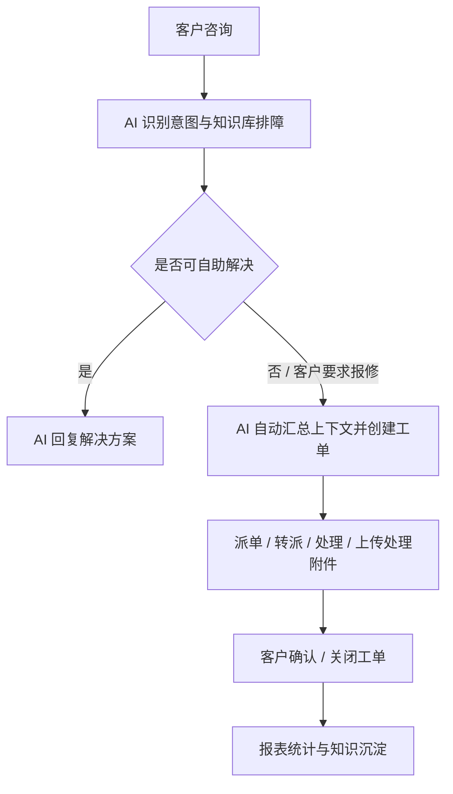

# IT 运维小助手需求应对方案（PPT 大纲 - 完整内容版）

> **文档说明：** 本文档专为 NotebookLM 生成 PPT 或播客讲解设计。在完全保留原版《01-需求应对方案-客户版.md》详细内容与所有截图的基础上，进行了适合 AI 解析的“Slide 幻灯片”结构排版，并增加了口语化的“演讲备注（Speaker Notes）”。

---

## Slide 1: 项目背景与痛点分析
**标题：项目背景**
**副标题：企业 IT 运维团队面临的日常挑战**

**详细内容：**
随着企业内部系统数量增加，IT 运维团队通常会面临以下问题：
- 员工咨询入口分散，问题容易散落在电话、群聊、私信和邮件中。
- 密码、VPN、系统登录、权限申请等高频问题重复出现，人工解答成本高。
- 客户提交问题时信息不完整，工程师需要反复追问错误提示、截图、影响范围等上下文。
- 工单流转过程不透明，客户难以及时了解进展，管理者也难以追踪服务质量。
- SLA、工程师效率、AI 解决率等指标缺少统一统计，IT 服务价值不易量化。

**我们的对策：**
本方案建议基于现有“星敏数字员工平台”扩展建设 IT 运维小助手，不从零开发独立系统。平台已具备 IM 会话、AI 智能体、知识库、工单管理、附件上传、派单规则、SLA、报表等基础能力，可快速形成一套面向 IT 运维场景的服务闭环。

> 

**演讲备注（Speaker Notes）：**
各位客户好。在传统的 IT 运维中，最大的痛点就是“散”和“重复”。问题散落在各个群里，工程师每天都在回答“密码怎么重置”、“VPN连不上”这样的重复问题，效率极低。我们的方案不是给您从零写一套系统，而是基于已经非常成熟的“星敏数字员工平台”，快速为您搭建一套闭环的运维中心。

---

## Slide 2: 建设目标
**标题：建设目标**
**副标题：从单纯的机器人到完整的 IT 服务体系**

**详细内容：**
本项目目标不是单纯建设一个聊天机器人，而是建设一套“可咨询、可排障、可建单、可处理、可追踪、可统计”的 IT 运维服务体系。核心建设目标包括：
1. 建立统一 IT 咨询入口，支持自然语言提问、图片、截图和文件提交。
2. 通过 AI 智能体和知识库优先解决常见问题，减少人工重复解答。
3. 对无法自助解决的问题，自动或手动生成工单，进入标准处理流程。
4. 工单支持派单、转派、处理、附件反馈、客户确认、关闭和重开。
5. 技术人员可从工单直接进入客户会话，继续沟通并发送处理文件。
6. 建立工单类型、用户分组、SLA 和派单规则，适配不同运维团队。
7. 建立 IT 运维报表，量化会话量、工单量、AI 解决率、处理效率和 SLA 达成情况。
8. 为后续对接密码重置、账号开通、权限查询等第三方系统 API 预留扩展能力。

**演讲备注（Speaker Notes）：**
我们的目标非常明确：不仅要能“聊”，更要能“干活”。我们要打造的是一个统一入口，AI 挡在最前面解决高频问题，解决不了的自动变成工单派给相应的工程师。最终，整个过程必须是可被统计的，为管理层提供清晰的数据报表。

---

## Slide 3: 方案全景架构
**标题：方案全景**
**副标题：AI 前置处理 + 工单闭环管理 + 数据运营分析**

**详细内容：**
系统整体采用“AI 前置处理 + 工单闭环管理 + 数据运营分析”的架构。客户通过 IM 会话提交问题后，AI 小助手会先识别问题意图：
- 如果是常见咨询，AI 直接给出知识库答案或引导式排障步骤。
- 如果需要工程师处理，AI 自动汇总上下文并创建工单。
- 如果客户继续补充错误码、截图或其他信息，系统可更新已有工单。
- 如果客户表示问题已解决或不再需要处理，系统可关闭或更新工单。
- 工单处理过程中，工程师可进入会话继续沟通，并将处理附件发送给客户。

**业务流转图：**

**演讲备注（Speaker Notes）：**
大家可以看一下这个全景架构和流程图。这是一个非常经典的漏斗模型：最上面是 AI 识别意图，中间是知识库和引导式排障进行拦截，最下面漏到人工的，自动变成带有完整上下文的工单，工程师处理完后，数据自动沉淀为报表和知识。

---

## Slide 4: 核心功能说明 - AI 智能问答与自助排障
**标题：AI 智能问答与自助排障**
**副标题：IT 服务的一线入口**

**详细内容：**
AI 小助手可作为 IT 服务的一线入口，对常见问题进行自动识别和回复。
主要能力：
- 支持密码、VPN、ERP/OA 登录、权限申请、网络异常等常见问题咨询。
- 支持根据知识库回答标准问题，降低人工重复解答。
- 支持引导式排障，按步骤收集系统名称、错误码、影响范围、截图等信息。
- 支持动态分支判断，根据客户回答决定继续排障、转人工或创建工单。
- 支持文本、图片和文件等多类型消息。

> 
> 

**演讲备注（Speaker Notes）：**
在日常咨询中，AI 会充当第一道防线。除了直接回答问题，我们系统最大的亮点是“引导式排障”。就像图中展示的配置界面一样，系统可以像树状图一样，一步一步问客户“是整个办公室断网还是只有你”，根据客户的回答动态决定下一步动作。

---

## Slide 5: 核心功能说明 - AI 自动创建与更新工单
**标题：AI 自动创建与更新工单**
**副标题：告别繁琐的报修表单**

**详细内容：**
当客户明确要求报修，或 AI 判断问题需要工程师介入时，系统可自动创建工单。
主要能力：
- AI 自动总结客户问题，生成工单标题、问题描述、类型和优先级。
- 自动关联客户、会话、语言、截图和文件附件。
- 自动返回准确工单号，便于客户后续追踪。
- 客户补充错误码、截图或处理要求时，可更新当前会话已有工单，避免重复建单。
- 客户表示“问题已解决”“不用处理了”时，可触发工单关闭或状态更新。
- 内置 AI 测试与评估能力，可验证“应排障不建单、应建单、应更新、应关闭”等场景。

> 
> 

**演讲备注（Speaker Notes）：**
如果排障失败，AI 会直接根据之前的聊天记录和截图，自动生成一张工单，客户什么都不用填。如果客户发完工单又补充了一张报错截图，AI 会智能地把截图追加到刚才的工单里，不会生成垃圾工单。为了保证 AI 这么聪明的操作不出错，我们还提供了一个自动化的跑分测评平台，上线前可以验证 AI 的准确率。

---

## Slide 6: 核心功能说明 - 专业工单管理
**标题：专业工单管理**
**副标题：清晰、严谨的流转状态**

**详细内容：**
系统提供完整工单管理后台，支持从 AI 会话、人工客服和后台手动创建工单。
工单核心字段包括：工单编号、标题、问题描述；工单类型、优先级、状态、来源；客户、当前处理人、关联会话；要求完成时间、处理完成时间；处理结果、附件、评论和操作时间线。

工单支持的主要状态包括：待派单、待处理、处理中、待确认、已解决、已关闭、已取消、已挂起。

系统可在工单列表中展示各类关键信息，方便管理人员快速定位重点工单。

> 
> 

**演讲备注（Speaker Notes）：**
工单流转到后台，就进入了专业的管理阶段。我们的工单系统支持非常完整的状态流转。管理人员可以在列表中清晰地看到每个工单的 SLA 时效状态，谁在处理，有没有超时，一目了然。

---

## Slide 7: 核心功能说明 - 派单规则与 SLA 管理
**标题：派单规则与 SLA 管理**
**副标题：自动化路由，保障服务时效**

**详细内容：**
系统支持按规则自动派单，减少人工分配成本。
派单规则可结合以下条件：工单类型、优先级、客户类型、客户标签、客户语言、用户分组、默认处理人。

SLA 管理支持配置不同类型、不同优先级、不同客户类型下的响应和解决时限。系统可根据规则自动计算工单要求完成时间，并在列表和详情中展示 SLA 状态。

> 

**演讲备注（Speaker Notes）：**
为了减少人工分发工单的成本，系统内置了强大的派单引擎。您可以根据工单类型（比如网络问题自动派给网络组）或者客户语言进行自动路由。配合 SLA 配置，系统会自动计算必须在几点前处理完毕，超时会有预警。

---

## Slide 8: 核心功能说明 - 技术人员高效工作台
**标题：技术人员高效工作台**
**副标题：工单与会话的无缝穿透**

**详细内容：**
工单详情页以多 Tab 方式展示完整处理上下文：
- 内容：展示问题描述、处理结果、附件与截图。
- 时间线：展示创建、派单、转派、处理、确认、关闭等完整过程。
- 评论：支持内部说明和客户可见说明。
- 关联会话：直接查看客户原始会话内容。
- 附件：支持图片预览和文件打开。

技术人员处理工单时，可从工单列表或详情点击进入关联会话，与客户继续沟通。处理过程中上传的修复说明、配置文件或截图，可同步保存为工单附件，并推送到客户会话中。

> 
> 
> 
> 

**演讲备注（Speaker Notes）：**
这是专为工程师打造的工作台。工程师在看工单时，点开“关联会话”就能看到客户之前跟 AI 聊了什么，发了什么图。如果觉得不清楚，点击一个按钮就能直接切入聊天界面和客户对话。工程师上传的修复文档也会直接发送到客户的微信里，双向完全互通。

---

## Slide 9: 核心功能说明 - 工单配置能力
**标题：工单配置能力**
**副标题：灵活适配不同客户的组织架构**

**详细内容：**
系统提供工单基础配置能力，便于客户根据自身组织情况维护数据。
当前支持：
- 工单类型配置，例如账号问题、密码问题、网络问题、系统故障、权限申请等。
- 用户分组配置，例如桌面支持组、网络支持组、系统运维组、权限管理组等。
- 用户组成员维护，支持显示用户编号、账号和用户名称。
- SLA 标准配置，支持按工单类型、优先级、客户类型设置时限。

> 
> 

**演讲备注（Speaker Notes）：**
每个企业的 IT 部门架构都不一样，所以我们的系统是高度可配置的。您可以自行定义工单类型、自行建立像“桌面组”、“网络组”这样的处理团队。未来如果公司架构调整，您只需要在后台改改配置即可。

---

## Slide 10: 核心功能说明 - 数据报表与运营分析
**标题：数据报表与运营分析**
**副标题：让 IT 服务价值可量化**

**详细内容：**
系统已提供 IT 运维报表聚合看板，帮助管理层从数据角度查看服务质量。
报表可关注：会话量、工单量；AI 解决率、工单解决率；超时工单数量；工单类型分布；优先级分布；工程师处理效率；SLA 达成情况。

通过报表，IT 管理者可以识别高频问题、薄弱环节和人员负载情况，从而持续优化知识库、派单规则和服务流程。

> 
> 

**演讲备注（Speaker Notes）：**
最后是管理层最看重的报表。系统提供了丰富的聚合看板，您不仅能看到 AI 帮团队挡下了多少工作量，还能看到各类型故障的分布趋势，以及每个工程师的处理效率。数据驱动，让 IT 部门的工作成绩一目了然。

---

## Slide 11: 典型业务场景示例
**标题：典型业务场景**
**副标题：全场景覆盖，提升服务体验**

**详细内容：**
- **自助排障（忘记密码）**：客户咨询“ERP 密码忘记了怎么办”。AI 先给出自助找回建议。客户价值：减少简单问题人工介入。
- **自动报修（VPN 报错）**：客户反馈 VPN 报错 809，AI 判断需工程师介入，自动创建工单并带入错误码和上下文。客户价值：无需填表，工程师接单即有完整背景。
- **工单更新（补充截图）**：客户在会话中补充刚刚 VPN 工单的报错截图，系统识别为更新已有工单，而非重复建单。客户价值：避免重复工单，提升准确性。
- **发送修复附件**：工程师处理工单时上传配置文件，系统自动发到客户会话。客户价值：处理结果清晰送达。
- **客户提前关闭**：客户表示“问题已解决”，系统自动关闭关联工单。客户价值：流程自然闭环。

**演讲备注（Speaker Notes）：**
这几个场景是日常发生频率最高的。无论是简单的密码重置引导，还是复杂的报错自动建单，或者是客户随手补发一张截图，系统都能智能应对。工程师处理完发个文件，客户立刻能在对话框收到，体验非常流畅。

---

## Slide 12: 我们的竞争优势
**标题：本系统优势**
**副标题：基于成熟平台，交付快，真闭环**

**详细内容：**
- **基于成熟平台扩展，交付周期更短**：在星敏平台上扩展，已有 IM、AI、知识库、工单、报表等基础能力，降低交付风险。
- **AI 与工单闭环结合，不只是聊天机器人**：不仅能回答问题，更能完成派单、处理、反馈、确认的完整服务流程。
- **会话上下文自动沉淀，减少重复沟通**：客户原始描述、截图自动带入工单，工程师直接查看，避免反复询问。
- **技术人员可从工单直接沟通客户**：一键穿透工单与会话。
- **可配置化适配客户组织**：工单类型、分组、派单规则灵活配置。
- **全程留痕，可审计可追溯**：所有动作形成记录，满足审计要求。
- **先闭环，后自动化**：先跑通咨询工单流程，再逐步对接外部 API（密码重置、开通账号等）。

**演讲备注（Speaker Notes）：**
总结一下，选择我们，您得到的是一套交付周期极短、功能极其成熟的平台。它不是一个只能聊天的玩具机器人，而是一个真正的生产力工具。它把会话和工单深度融合，不仅解决了当下的痛点，还为未来对接业务系统实现“自动化运维”打下了基础。

---

## Slide 13: 实施路径与预期收益
**标题：实施路径与预期收益**
**副标题：三步走策略，稳健落地**

**详细内容：**
**实施路径：**
- **第一阶段：演示验证与基础闭环**（跑通 AI 咨询、创建工单、派单处理到报表的完整流程）
- **第二阶段：试点上线与规则完善**（配置真实 SLA、处理组，完善知识库与 AI 测例）
- **第三阶段：自动化运维扩展**（对接外部系统 API 实现高频动作自动化，扩展企微协同）

**预期收益 (ROI)：**
- **效率收益**：AI 处理预计减少 30%-50% 咨询量；自动收集上下文减少 20%-40% 沟通；SLA 提升 30% 响应效率。
- **管理收益**：服务过程可量化；经验可沉淀至知识库；高危操作可审批审计；支撑多团队多语言的扩展。

**演讲备注（Speaker Notes）：**
在落地计划上，我们建议分三步走：先用标准流程做演示验证，然后引入您真实的业务数据做试点，最后再去对接各个业务系统做深度的自动化。系统上线后，保守估计能减少 30% 到 50% 的无效咨询量，大大提升 IT 团队的响应效率和管理水平。期待能与您携手合作。