# 星敏数字员工系统功能介绍

## Slide 1: 封面
**标题**：星敏数字员工系统功能介绍
**副标题**：企业级智能服务与业务协同平台
**演讲者**：黄健敏

---

## Slide 2: 产品概述
**核心理念**：
数字员工不仅是单一的聊天机器人，也不是只能做客服接待的轻量工具，而是一套**可持续扩展的企业级平台**。

**关键能力与底座**：
- 以自研 IM 通信能力为连接底座
- 以 AI 智能体、知识库、工作流为智能核心
- 深度整合客户管理、业务表单、审批协同等扩展能力

**全面升级方向**：
- 从人工接待 $\rightarrow$ AI 与人工协同
- 从零散回复 $\rightarrow$ 统一服务口径
- 从单次沟通 $\rightarrow$ 客户资产长期沉淀
- 从即时响应 $\rightarrow$ 流程协同与业务闭环
- 从单点工具 $\rightarrow$ 可复制的平台能力

---

## Slide 3: 建设目标与核心痛点解决
**企业常见痛点**：
- **客户响应慢**：依赖人工在线值守，高峰期或非工作时段难以及时承接，导致客户流失。
- **服务口径不统一**：不同员工回答标准不一致，知识过度依赖个人经验。
- **AI 难真正落地**：市面工具只有问答，缺乏知识、规则、流程与人工协作机制。
- **客户数据不沉淀**：客户资料、会话过程、处理结果散落在各工具中，难运营、难复盘。
- **协同效率低**：报价、审批、资料、表单等仍靠线下传递。

**数字员工建设目标**：
1. **提升客户接待效率**：通过智能体、在线工作台、智能分流快速响应。
2. **统一服务口径与处理规则**：将服务经验沉淀为系统的知识库与提示词能力。
3. **建立高效人机协同模式**：AI 处理高频标准问题，人工承接复杂敏感场景。
4. **沉淀客户与服务数据**：将会话、表单、审批转化为长期资产。
5. **支撑后续行业化扩展**：在智能底座上按需扩展报价、订单、商品等模块。

---

## Slide 4: 系统整体闭环与运作架构
**核心业务闭环**：
数字员工围绕“客户接入 - 智能处理 - 人工协同 - 数据沉淀 - 业务协同”形成完整链路：
1. **多端接入**：客户通过官网、二维码、链接、插件页进入。
2. **智能识别**：系统识别入口、客户属性与服务策略。
3. **AI 首轮处理**：结合知识库、商品数据、工作流进行首轮接待。
4. **转人工兜底**：命中复杂问题或重点客户后，无缝转交人工。
5. **统一工作台跟进**：人工继续沟通，查看全量客户信息，推进业务。
6. **数据留痕**：会话、表单、审批动作统一沉淀。
7. **业务延伸**：按需进入报价、订单、资料下载等后续环节。

**角色分工**：
- **AI 智能体**：内容识别、基础问答、效率提升。
- **知识与规则**：统一口径、约束逻辑。
- **人工坐席/业务员**：复杂问题、异常情况、最终判断。
- **管理平台**：过程留痕、协同待办、数据分析。

---

## Slide 5: 全渠道接入入口与覆盖
**模块价值**：
打破渠道孤岛，实现“客户在哪里，服务入口就在哪里”。支持多形态、多平台的无缝接入，全方位覆盖客户触点。

**支持的客户端入口**：
- **网页客服**：支持独立网页链接、PC 端与移动端网站插件页。
- **微信生态**：支持微信公众号、微信小程序、微信个人号接入。
- **企业微信**：支持企微客服、企业微信群等企微生态。
- **抖音平台**：支持抖音企业号、抖音私信接入。
- **其他入口**：支持线下扫码（二维码）、APP 内嵌等多种客户端入口。

**系统界面**：
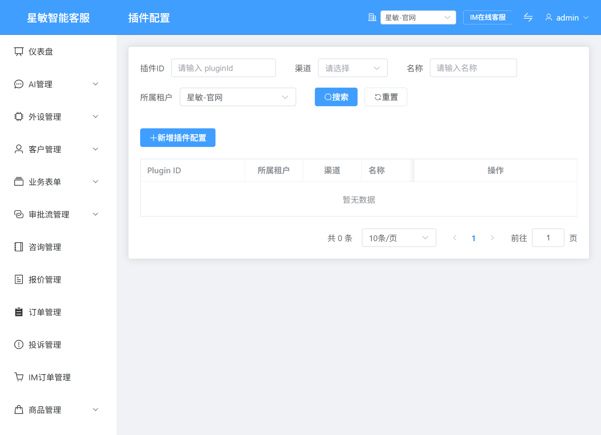

---

## Slide 6: 平台运行总览 (首页看板)
**模块价值**：
管理者和执行人员的总览页面，集中查看平台运行状态和当前服务节奏，对“系统现在发生了什么”一目了然。

**核心关注指标**：
- 今日会话量与趋势变化
- AI 独立处理量 vs 转人工数量
- 待接入客户与人工服务中会话
- 快捷处理入口与待处理事项

**系统界面**：
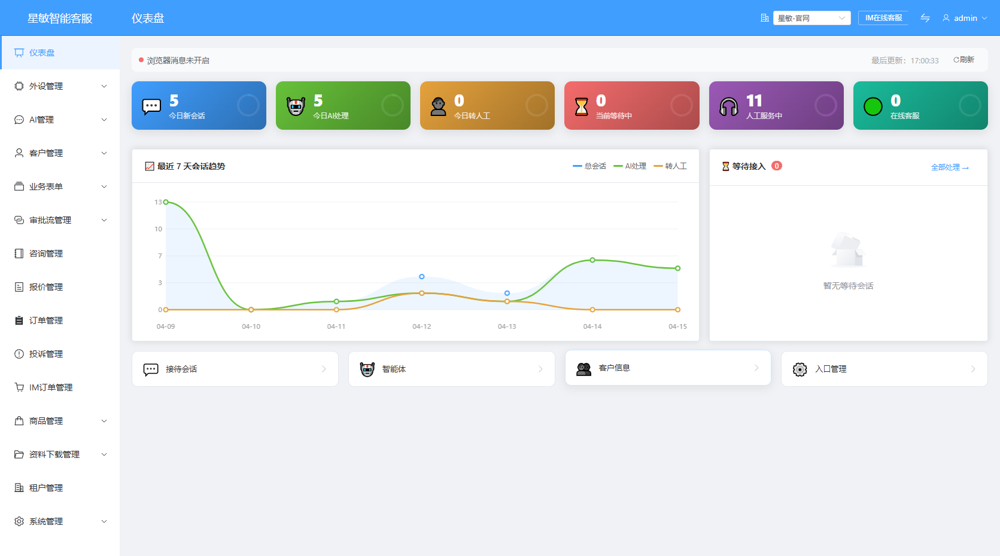

---

## Slide 7: 平台基石 - 系统管理
**模块价值**：
面向管理员与负责人，决定了平台是否能长期稳定、安全、规范地运行。

**核心功能**：
- **用户与角色管理**：维护平台账号、定义岗位角色能力范围。
- **权限与审批**：严格控制菜单、按钮、数据操作边界。
- **参数与字典配置**：统一维护状态值、运行参数和业务开关。
- **操作日志**：记录关键操作过程，满足审计与追溯要求。

**系统界面**：
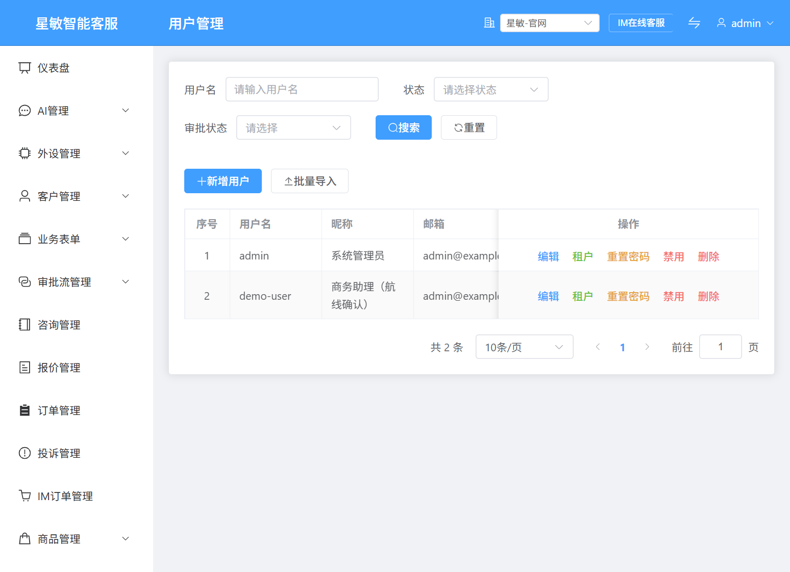

---

## Slide 8: 客户资产沉淀 - 客户管理与持续运营
**模块价值**：
帮助企业从“一次性会话处理”走向“长期的客户经营”。把对话转化为长期客户资产，为后续跟进、报价、审批提供统一对象基础。

**核心功能**：
- **客户信息与规则**：维护基本资料、来源、状态；配置客户归属与分配策略。
- **客户标签分层**：对客户进行多维度的分类、分层、分组管理。
- **客户联系任务**：维护后续跟进任务、回访计划和运营动作。

**系统界面**：
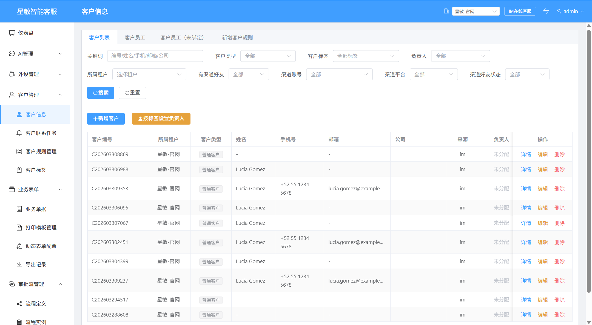
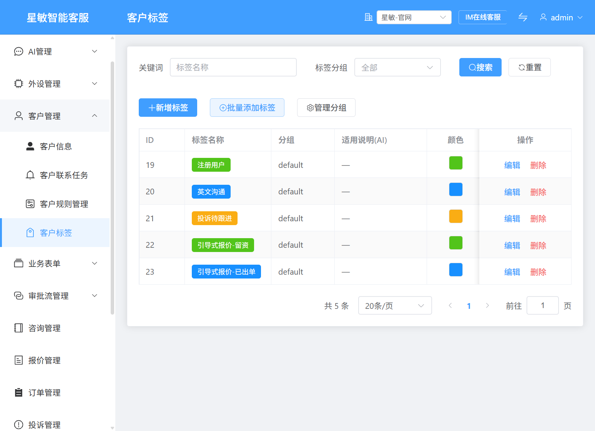

---

## Slide 9: 服务协同与闭环管理
**模块价值**：
承接客户服务问题，记录全过程，并推动问题彻底闭环。提升服务透明度与责任清晰度。

**核心功能**：
- **咨询管理**：统一管理客户咨询记录、归档处理情况。
- **投诉管理**：记录和跟进客户投诉，形成标准化闭环。

**系统界面**：
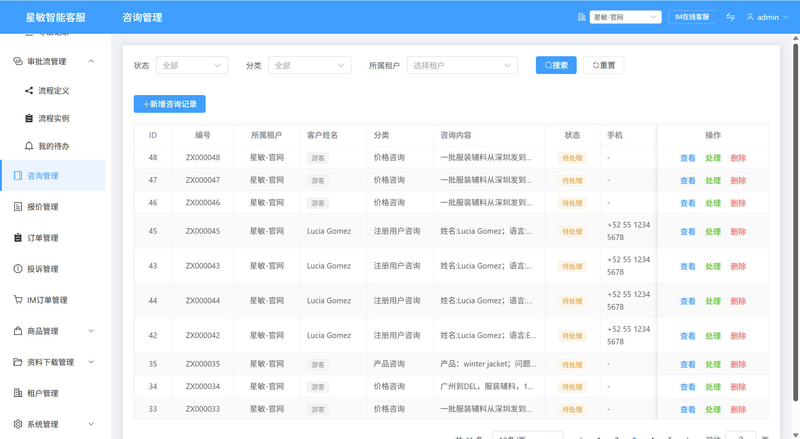

---

## Slide 10: 核心能力 - IM在线客服与会话全景
**模块价值**：
一线坐席的核心工作台。让客服处理有上下文、有客户信息、有全量留痕。

**核心功能**：
- **IM 在线客服**：实时接待、查看历史消息、联动客户主档。
- **IM 会话管理**：全量历史会话检索，回看 AI 与人工的协作过程，辅助复盘与策略优化。

**系统界面**：
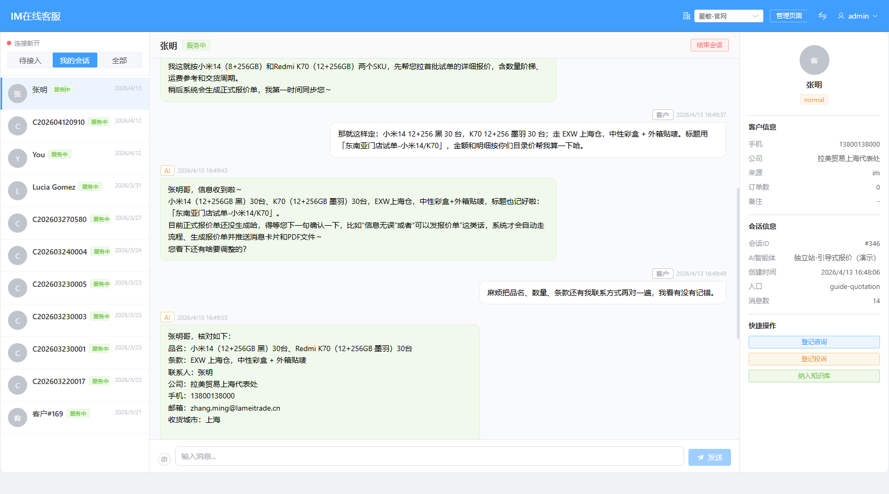
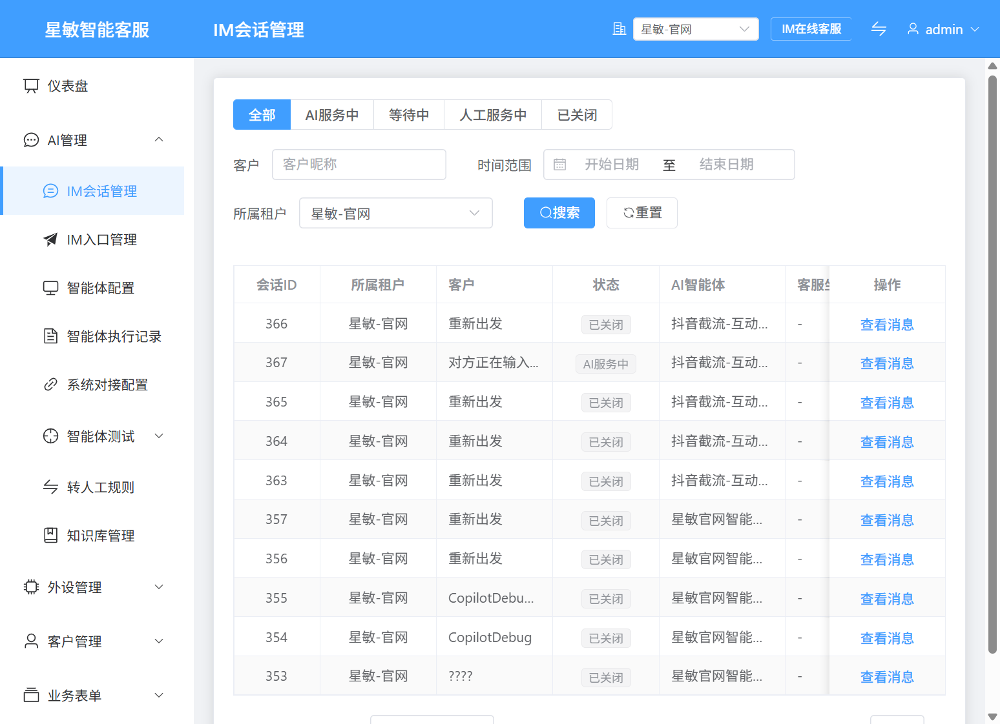

---

## Slide 11: 核心能力 - AI智能体与知识库矩阵
**模块价值**：
数字员工的智能大脑。把企业服务经验转化为可配置、可维护、可持续优化的智能能力。

**核心功能**：
- **智能体配置**：自定义系统提示词、模型参数、关联专属知识库与工作流。
- **知识库管理**：统一沉淀标准问答、业务知识，降低员工经验依赖，保障 AI 回答质量。
- **AI 执行记录**：让 AI 可观测、问题可追踪，优化有数据依据。

**系统界面**：
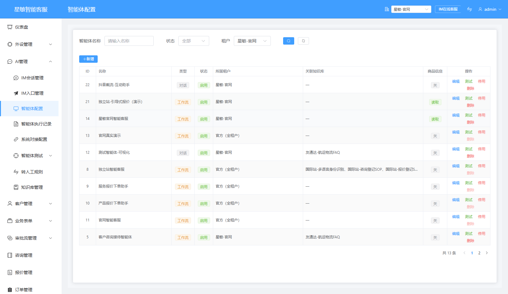

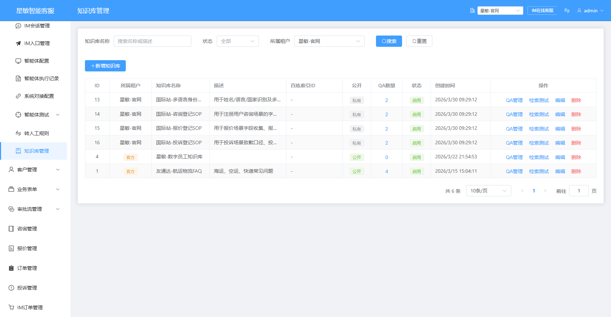

---

## Slide 12: 核心能力 - 人机协作、智能路由与多端接入
**模块价值**：
实现不同业务、不同客户的差异化接待，并让 AI 与人工形成完美接力。

**核心功能**：
- **转人工规则**：配置高风险问题、重点客户、连续未解决等场景的自动转接策略。
- **智能体路由**：根据入口或客户标签，将请求自动分配给最合适的智能体。
- **多渠道与入口管理**：支持二维码、链接、插件、微信、企微等多渠道统一接入，并配置差异化欢迎语。

**系统界面**：
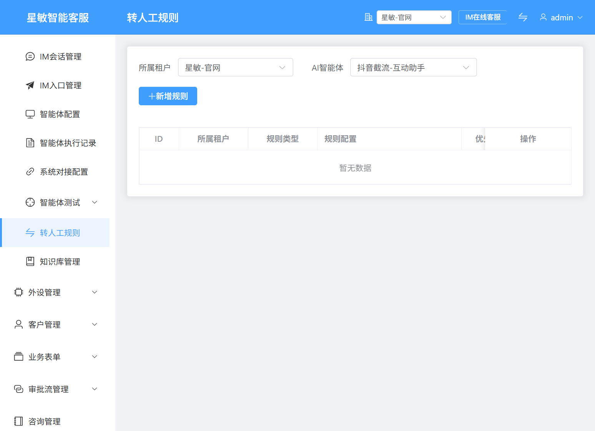
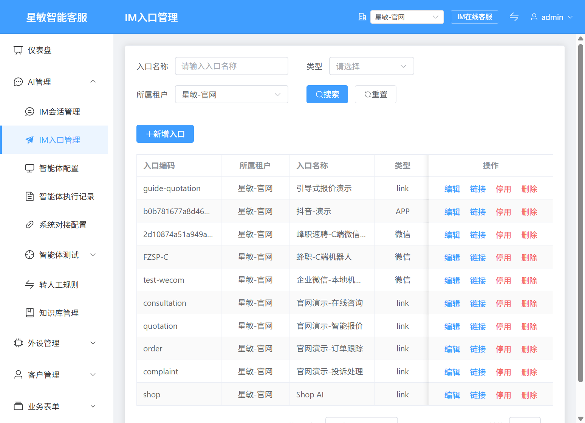
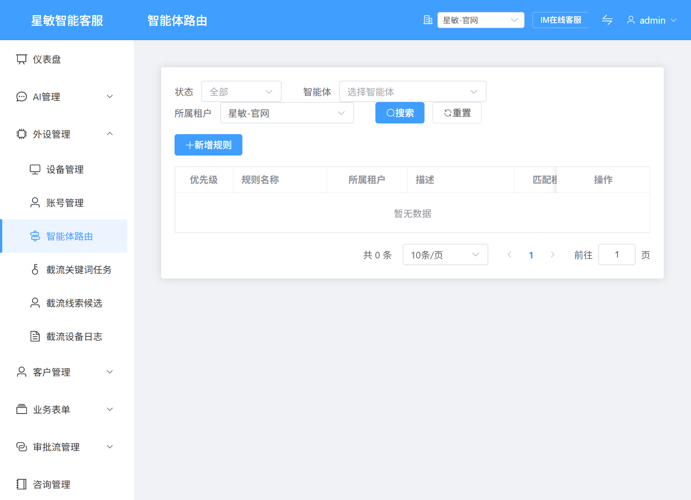

---

## Slide 13: 智能体评估 - 科学测试与持续优化
**模块价值**：
让 AI 从“能用”走向“可验证、可比较、可持续优化”。

**核心功能**：
- **测试用例**：维护典型问题样本与标准输入输出。
- **测试方案**：组织用例集合，支撑版本迭代和回归测试。
- **测试记录**：查看执行结果、对比效果和评估得分。

**系统界面**：

---

## Slide 14: 业务协同 - 动态表单与无纸化审批流
**模块价值**：
跳出纯聊天范畴，将信息收集、业务确认转化为标准化、可流转的结构化数据。

**核心功能**：
- **业务表单**：动态表单配置（字段/规则），支持业务单据的生成、模板打印与导出。
- **审批流管理**：自定义审批流程与处理规则，集中处理个人待办，让协同从线下转至线上。

**系统界面**：
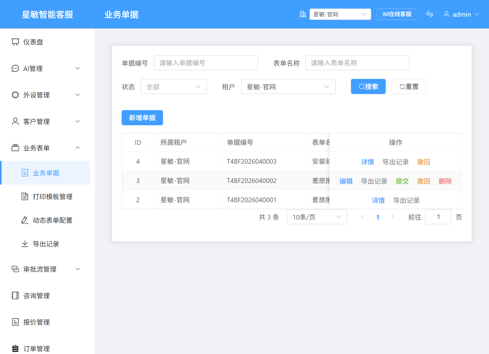
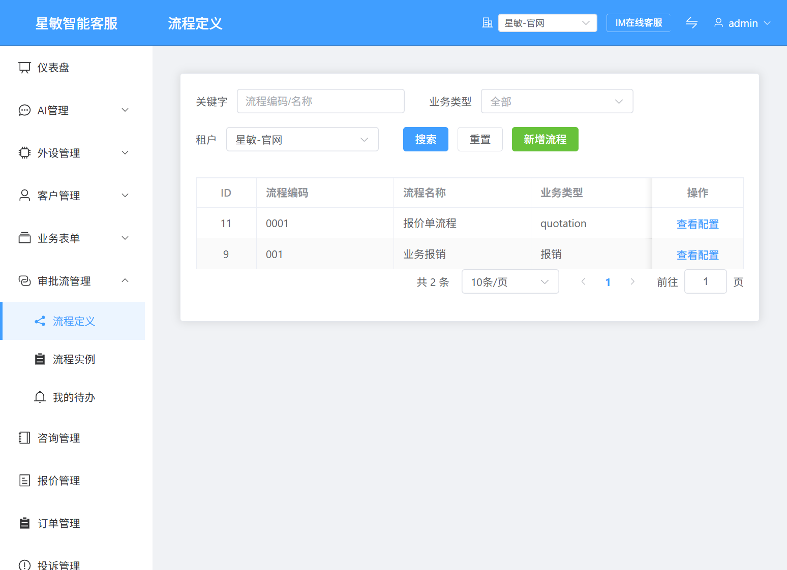

---

## Slide 15: 行业扩展应用 - 报价与订单闭环 (以报价场景为例)
**模块价值**：
展示平台的深度延展性，把客户咨询、商品匹配、价格策略、审批发送整合成标准流程。

**核心逻辑与功能**：
- **快速建单**：带入客户上下文，告别重复建单。
- **智能录入 SKU**：支持文本粘贴、图片识别、Excel 批量导入。
- **立体价格策略**：历史价格复用、规则自动带入、按分类批量改价、单行人工修正。
- **流程闭环**：报价单生成 $\rightarrow$ 提交审批 $\rightarrow$ 发送客户 $\rightarrow$ 转订单。

**系统界面**：

---

## Slide 16: 行业扩展应用 - 商品、价格体系与资料权限
**模块价值**：
支撑标准化业务运转，满足多行业扩展需求。

**核心功能**：
- **商品与价格体系**：管理商品分类、SPU、SKU、BOM；配置全局价格规则与策略。
- **资料下载管理**：资料分类、权限审批闭环，让高价值文件发放安全可控。
- **线索与增长场景**：截流关键词任务、线索候选沉淀，助力业务转化。

**系统界面**：
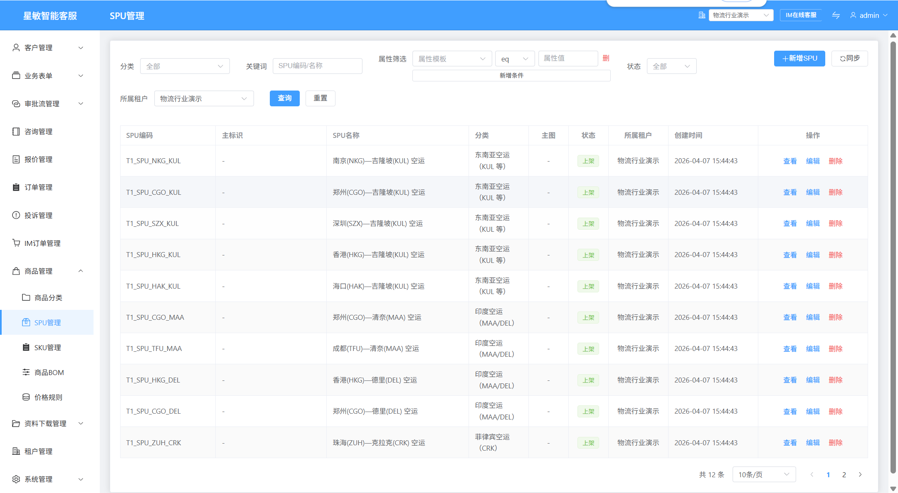
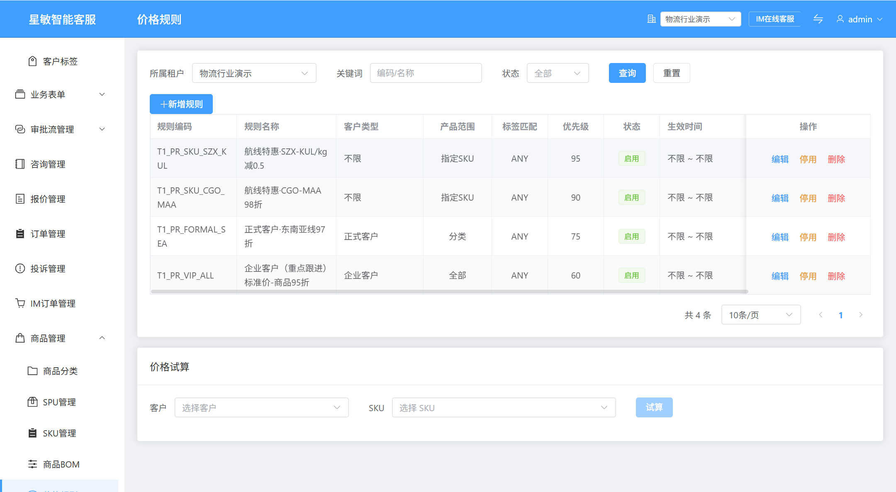

---

## Slide 17: 平台核心亮点总结
1. **统一的前后台协同**：
   客户入口、会话处理、客户主档、表单、审批、报价等能力全部统一在一个平台，告别多工具切换。
2. **真正的人机协同**：
   并非简单用 AI 替代人工，而是通过知识库、路由与转人工规则，实现完美接力。
3. **高度配置化与可扩展性**：
   工作流、路由、表单、业务规则均强调配置化，轻松应对行业化扩展。
4. **客户资产的持续沉淀**：
   从接入到单据，全链路数据转化为企业长期可经营的数字资产。
5. **多角色长期可用**：
   客服、销售、运营、主管、管理员皆有专属工作界面。

---

## Slide 18: 实施建议与预期成效
**建议的三阶段建设路径**：
1. **核心智能落地**：看板、在线客服、智能体、知识库、转人工规则。
2. **流程协同建设**：客户标签、联系任务、业务表单、审批流。
3. **行业深化扩展**：报价、商品体系、资料下载、外部系统对接。

**项目预期成效**：
- 客户咨询响应速度大幅提升。
- 常见问题处理更标准、稳定。
- 内部协同更顺畅，待办高度集中。
- 为后续业务增长与运营提供强有力的统一底座。

---

## Slide 19: 结语
**数字员工系统**
价值不仅在于“让回复更快”，更在于帮助企业建立一套：
**可接待、可协同、可沉淀、可扩展** 的数字化服务体系。

无论是从智能服务切入，还是向业务协同和行业化延伸，
数字员工都是企业长期建设数字化服务能力的理想平台。

---
*联系人：黄健敏 | 电话：18620588898*